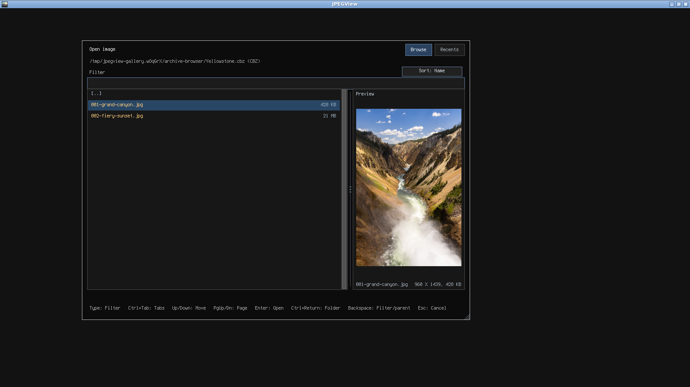
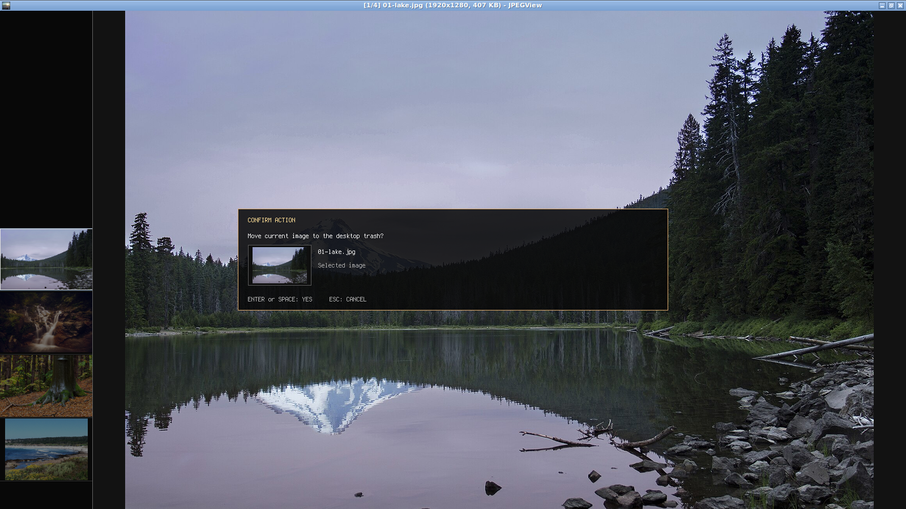
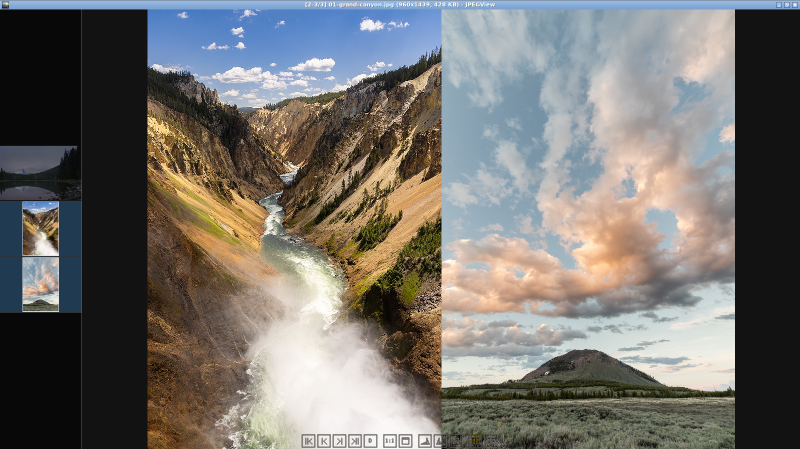
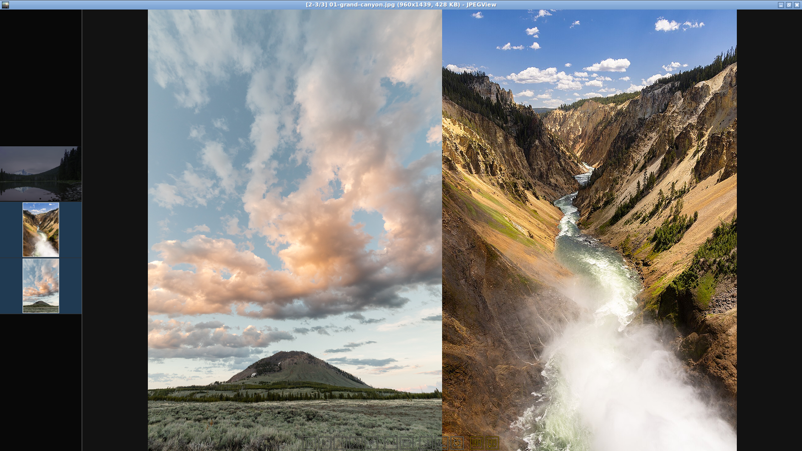
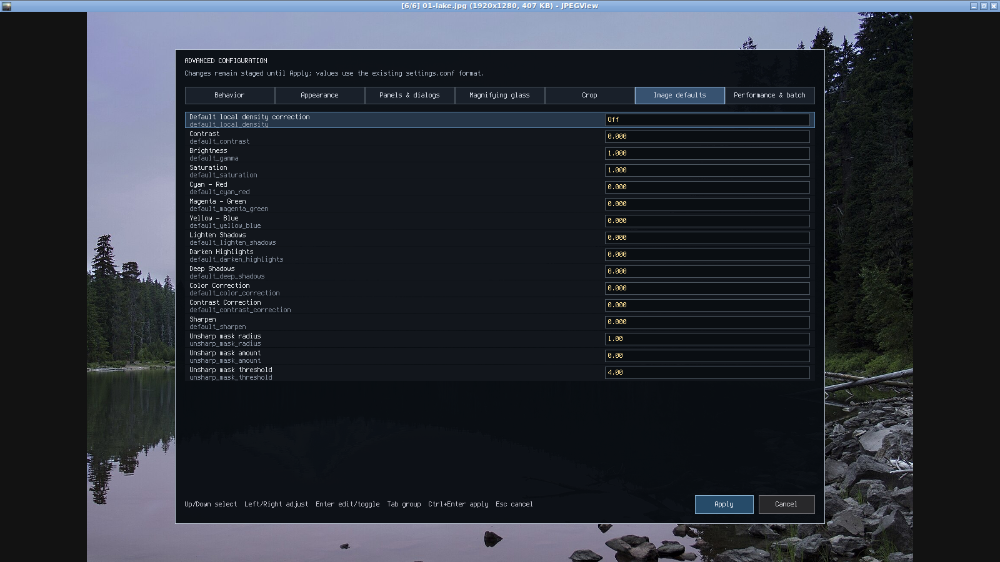
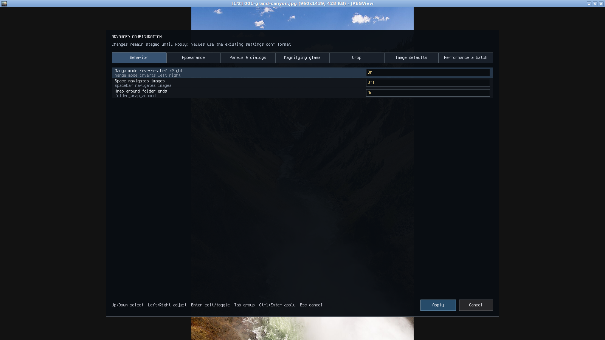

# JPEGView Linux frontend

This directory contains the first native Linux deliverable for upstream JPEGView v1.3.46.
The original Windows/ATL/WTL project remains unchanged under `src/`.

## Linux branch changes, in order of importance

This is the complete grouped summary of features and changes made since the native Linux branch
split from the Windows frontend. Later fixes, tests, and refactorings are grouped with the feature
they support.

1. **Native Linux viewer, AppImage, and Ubuntu 24/26 Debian packages.** A native SDL2 frontend now opens individual
   images, multiple command-line inputs, and directories without modifying the original Windows
   application. It includes a resizable/maximizable/fullscreen window, drag-and-drop, a desktop
   entry, the upstream JPEGView application icon, Ubuntu 20.04, 22.04, 24.04, and 26.04 build containers,
   AppImage packaging with bundled SDL and codec runtimes, and Ubuntu 24.04/26.04 `.deb` packages
   whose build and runtime dependencies come from the corresponding standard Ubuntu repositories.

2. **Broad native format and color support.** Linux decoding covers JPEG, PNG/APNG, GIF, BMP, TGA,
   PSD, PNM, QOI, WebP, TIFF, HEIF/HEIC, AVIF, JPEG XL, JPEG XR, LibRaw camera formats, and flattened
   Krita `.kra` projects. A Krita project opens as one image from its root `mergedimage.png`; editable
   layers are not exposed. Embedded color profiles are transformed through LCMS2. Supported images
   inside ZIP/CBZ, TAR,
   gzip-compressed TAR, 7z/CB7, and RAR containers can also be browsed and viewed. CBZ comic ZIP
   archives reuse ZIP browsing, and CB7 comic 7z archives reuse 7z browsing. The save dialog writes
   JPEG, PNG, BMP, TGA,
   WebP, GIF, TIFF, PSD, PNM, QOI, HEIF/HEIC, AVIF, and JPEG XL still images. Codec detection and fixtures
   were made portable across Ubuntu 20.04 and newer distributions, including giflib installations
   without pkg-config metadata and HEIF encoders with different supported profiles. Transparent PNG
   and other alpha-bearing images display over a configurable black, white, or checkerboard
   background without flattening or changing their source pixels.

3. **High-quality viewing, fitting, zooming, and panning.** JPEGView's high-quality downsampling and
   sharpening path was ported, with Catmull–Rom bicubic enlargement and a shared 1 GiB image-cache
   budget.
   Fitted JPEGs use libjpeg-turbo's native reduced DCT decode, avoiding full 4000×6000 pixel buffers
   when the screen needs only a smaller image. Actual-size viewing prepares source-resolution pixels;
   compatible cached frames with matching source, orientation, and processing settings can serve a
   lower-resolution view without another preparation. Enlargement reuses source-resolution pixels and
   lets the renderer scale the same texture, while panning changes its destination without repeating
   display preparation. Rotated double-page partners follow the same
   source-resolution limit, and spread admission estimates those prepared dimensions. When a retained
   higher-resolution anchor would make the pair exceed the shared budget, the viewer retries with a
   fitted anchor texture before falling back to single-page display. Neighbor images
   use their fitted navigation representation even when the selected image is zoomed. If selection
   needs more pixels, its foreground request prepares them after selection. With the optional histogram
   visible, a worker uses full-source pixels once to preserve its values, then retains the result with
   the display frame. Up to four hardware-aware, low-priority workers prepare
   nearby images concurrently. A bounded planner estimates each fitted frame's bytes and admits the
   nearest requests within the shared cache budget after reserving the selected source-resolution frame;
   this avoids sizing every neighbor from the selected image's zoom. Large JPEG input is memory-mapped,
   letting native decoding and repeated neighboring access use the kernel page cache without an extra
   stdio copy layer. Prepared frames are then uploaded incrementally and retained as renderer-ready
   textures. The closest next and previous files take
   preparation and upload priority, and an already prepared static image is presented without first
   copying its full decoded pixels on the UI thread; navigation therefore avoids CPU resizing and
   normally avoids texture upload as well. Decoded images, prepared frames, thumbnails, and previews
   share a source identity based on the logical path and backing file's device, inode, size, and
   nanosecond modification time. After a source refresh, cache lookups use its new identity and miss
   pixels retained under the old one. Speculative display preparation reserves room for at most two
   in-flight or unconsumed frames and 64 MiB of pixels; current-image and active-spread
   preparation stays admissible when those limits are full. Retained speculative image textures use
   at most the smaller of half the shared cache budget and 256 MiB; this is an internal limit, not a
   separate setting. Active spreads take priority, and no more than one speculative image upload runs
   in each renderer-maintenance opportunity. Interaction pauses speculative uploads. Image textures
   larger than 8 MiB upload in private bands of at most 4 MiB and become visible only after the full
   texture succeeds. Eligible bands resume promptly between event-loop waits; uploads held for cache
   admission resume when capacity returns. Obsolete image textures are retired incrementally after
   presentation, with their cache reservation held until renderer destruction completes.
   Fit mode
   uses the full client area without artificial top/bottom gaps and does not enlarge small images.
   Fit, fill, actual-size, and manual modes survive navigation appropriately. Selected JPEG header
   and display preparation, plus non-JPEG decoding, run asynchronously. The window keeps a loading
   title while selected work is pending, accepts navigation to replace it, and rejects completions
   from older source generations. A source change clears the former image; a lower-resolution texture
   for the same source can remain visible while its replacement prepares. Recents and loaded-image
   history update only after the first renderer-ready frame commits. Fit, fill, no-enlarge,
   actual-size, zoom-step, zoom-preset, pan, rotate, and mirror commands are retained for the pending
   source and applied in accepted order when the required geometry or source pixels are available.
   This includes copy and crop actions that need full-resolution source pixels. At most 256 actions are
   retained; later actions are rejected without changing the accepted sequence, and the window title
   reports when the limit is reached. Temporary zoom on one
   image resets to the selected mode by default. The opt-in `fit_relative_zoom_mode=1` instead defines
   the window-fit scale as 100%: zoom presets and steps keep the same relative effect on differently
   sized images, a zoom step pauses/snaps at that 100% fit anchor, and the relative zoom is carried
   to the next image and saved in its Recents snapshot.
   A temporary readout shows both fit-relative and source-pixel percentages (for example,
   `400% (100%)`). The option is off by default and is also available under Advanced configuration's
   Behavior category. Ctrl+wheel zooms around
   the pointer, mouse dragging pans, and repeatable Shift+Arrow commands pan an actual-size image in
   the original 48-pixel steps. Pan, zoom, fit-to-window and actual-size commands, wheel bursts, crop or
   navigator drags, held navigation, and window or thumbnail-panel resizing pause distant thumbnail and
   neighbor preparation and speculative texture uploads while the active image or spread remains available.
   Cold JPEG spread partners get asynchronous header-only dimension reads, while cold non-JPEG partners
   may be decoded; both remain eligible during navigation pauses. Pending active-spread work also
   pauses visible-thumbnail preparation and lets file-list scanning yield between enumeration units.
   Replacing the pending partner or disabling double-page mode cancels that partner's queued source
   work and suppresses publication from a blocked read when it returns.
   Selecting a pending JPEG partner transfers its matching dimensions read to the current-image load,
   so preparing the next spread partner cannot cancel the selected image's header request.
   Missing thumbnails in the visible strip may still load when no foreground source work is pending.
   Background work resumes 250 ms after
   interaction settles, including after a drag capture is released. A pending foreground image or spread
   also pauses visible-thumbnail preparation and lets the active file-list scan yield between enumeration
   units. When magnified beyond the viewport, a transient upper-right zoom
   navigator shows the whole image and the visible area; click or drag it to pan. Its visibility
   can be toggled from the context menu and persists between runs. A transient
   pointer-following magnifying-glass lens is also available: press
   `Z` or choose **Magnifying glass** in the context menu, then move over the image. It starts at
   2× and hides the pointer beneath it. Wheel down/up grows/shrinks the lens; Ctrl+wheel changes
   its height, Alt+wheel its width, and Shift+wheel its magnification. Higher-resolution lens
   pixels are prepared asynchronously at low priority while the ordinary image remains responsive.
   Lens size and magnification persist between runs; the lens itself starts disabled each time. The
   Windows crop/selection workflow is also ported: source-pixel selections can be moved and resized
   independently of zoom, then cropped, copied, losslessly cropped from JPEG, or used to zoom the view.
   Crop selection mode is off by default and can be enabled from the new navigation-panel button,
   either context menu, or with Ctrl+E; the explicit mode choice is saved between runs. Double-page
   mode (`D`) shows adjacent portrait pages together at a shared display height, leaving the first
   cover page on its own. Double-page manga mode (`J`) swaps their left/right placement. A known
   landscape page stays single and is shown without waiting for its neighbor's dimensions.
   Up/Down rotation turns the open spread as one unit: both pages stay visible and stack vertically
   after a quarter-turn, then return to a horizontal spread when rotated back. The spread remains
   paired if double-page mode is switched off and on while the rotation is applied.
   PageUp/PageDown remain logical previous/next. A pointer-following pixel sampler shows a swatch and
   `#RRGGBBAA` value; clicking the readout copies it. It samples decoded source pixels before live
   non-destructive levels adjustments and display scaling. For a fitted JPEG that is displayed from
   reduced pixels, full-resolution sampling starts asynchronously after the pointer moves over the
   committed image; opening an image with a stationary pointer does not trigger that extra decode.
   Rotate, mirror, and crop update the sampled document coordinates while preserving the source
   colors. The two checkable
   controls appear in the navigation panel and context menu. Page pairs follow
   [YACReader's 9.9.1.0 behavior](https://github.com/YACReader/yacreader/blob/982d58246cdd3b42b00b6aaaef5666c73869174d/YACReader/render.cpp#L446-L566).
   Spread navigation prepares both pages at their final slot sizes through background workers and
   reveals them together in one frame; while a cold spread is being prepared, the viewer does not
   flash the anchor page alone or shift it when its partner arrives.
   The filename and F2 information overlays show both active spread positions (for example `1-2/123`);
   single-page display retains the `1/123` form. Manga mode reverses physical Left/Right navigation
   by default; set `manga_mode_inverts_left_right=0` in `settings.conf` to keep the normal key direction
   while retaining manga page placement.

   Source-consuming work from independent decode, display, thumbnail, metadata, directory, and archive
   workers shares admission: one speculative or metadata source task may read at a time, foreground
   source work has a separate lane, and pending foreground work stops new background source admission.
   A partner in the currently displayed spread receives foreground admission so it cannot wait behind
   the foreground operation that is waiting for that partner.
   Archive members coordinate by their backing container. A shared CPU-processing pool uses a
   hardware-aware limit of at most four active workers across those pools. When foreground work
   arrives during archive/catalog traversal, cancellation callbacks return immediately so paired
   source and CPU admissions are released; outer workers wait for foreground work to finish, discard
   partial results, and retry. Other metadata scans yield between entries or bounded batches.
   Cancellation reaches JPEG open/header and scanline batches, color
   conversion, resampling, and publication; opaque codec calls can only be checked before and after
   the call. A read already blocked by the filesystem may finish after foreground work arrives.
   Work that needs both source access and CPU processing receives both admissions together, and a
   queued request promoted by navigation joins foreground admission. Worker failures are reported
   through structured results or cache diagnostics, and canceled work releases its admission and memory
   reservations. Drawing reads prepared presentation state; source work, cache scheduling, completion
   application, and cache-recency updates run in the event/update phase. A static image is not
   continuously redrawn: the event loop waits for input, coalesced completion notifications, timed
   playback/transition/overlay deadlines, and a bounded fallback poll. Consecutive pointer-motion
   events are accumulated only while their button state and event target remain unchanged.

4. **Folder navigation and ordering.** The Windows `CFileList` behavior was ported for first,
   previous, next, and last navigation; multiple inputs; folder looping; recursive subfolders;
   sibling folders; reload; and previous-folder history. Ctrl+M marks one image; after moving to a
   second image, Ctrl+Left/Right alternates between the marked image and the image that was current
   when toggling began. Marking another image replaces the mark. Alt+Left/Right jumps directly to
   the first image in the previous/next populated sibling folder, independent of the active mode.
   Ordering supports logical filename,
   filesystem modification date, creation date, file size, and random modes in either direction.
   Ctrl+G opens a one-based **Go to image number** prompt for the current ordered file list; the
   same action is available in the context menu. Invalid or out-of-range numbers leave the current
   image selected.
   The active filename/date ordering is visible and switchable from both the navigation panel and
   context menu, and the selected mode is preserved between runs. By default, manga mode reverses
   physical Left/Right navigation; `manga_mode_inverts_left_right=0` disables that inversion while
   navigation-panel and context-menu actions remain logical previous/next. Folder navigation wraps
   at the ends by default; set `folder_wrap_around=0` to stop at the current list's boundary.
   Viewer file-list discovery now runs on a lazy, low-priority worker for startup, refresh, sibling
   folder jumps, recursive folder boundaries, dropped inputs, cross-folder marked-image toggles,
   and changes from multiple inputs to folder navigation. Enumeration, per-file metadata, sorting,
   and replacement-list construction stay off the SDL event thread. A directly named image is
   displayed from a provisional one-image list while the rest of its folder is scanned; a
   directory-only launch stays responsive and opens Browse if its completed scan is empty. New
   requests cancel obsolete scans, while generation, membership/order revision, and descriptor
   revision checks prevent stale results from replacing the current folder, restoring a removed file,
   or rolling back a refreshed source identity. Moving within the already-loaded list remains a constant-time index
   change without scanner locks or copies of the active list. Each entry retains the identity and file metadata
   captured during scanning, so painting, cache lookup, and thumbnail scheduling reuse that descriptor
   instead of restatting every path. Explicit reloads, application-owned writes, and worker-detected
   changes refresh the descriptor; outside edits are picked up by reload or when background work
   detects them, without a filesystem watcher. Archive-member identity combines the member's logical
   path with its archive container identity, so members stay distinct and replacing an archive
   invalidates its members. An edit to the selected picture reloads its pixels, while an edit to a
   visible double-page partner refreshes the spread dimensions and keeps the selected page anchored.
   Metadata-based reordering also keeps the selected file in place. A full-list reload rebuilds visible
   spread geometry against the refreshed order while keeping the selected page and its current pixels.
   Browse folder enumeration and both row orders now run in a cancellable background loader, like
   archive catalogs; replacing the folder or pressing Escape rejects the old result. The viewer's
   active file list uses a separate scanner. Sorting an already loaded list uses a separate
   CPU-admitted worker: the current order remains navigable until a complete sorted result is ready,
   and the source selected when that result is applied stays selected. A metadata refresh that
   changes the active sort key follows the same path. Filename comparison keys are computed once per
   entry, and ordinary-file identity, size, modification time, and available creation time are
   requested together through `statx`, with a fallback to `stat` when the kernel cannot provide the
   required fields.

5. **Responsive keyboard and mouse navigation.** Left/Right image navigation and menu/browser
   selection repeat while held. The open browser supports repeating Up/Down, PageUp/PageDown, and
   Home/End movement. Repeated image navigation presents progress immediately instead of freezing
   until key release. The plain mouse wheel selects the previous/next file, while holding Ctrl
   retains wheel zoom. `spacebar_navigates_images=1` changes Space to next and Shift+Space to
   previous; by default Space retains its fit/actual scale action. The keyboard Context Menu key and
   the original Windows numeric command IDs and corresponding supported default bindings are retained.

6. **Neighboring-image thumbnail panel.** Ctrl+T or the context menu opens a vertical strip on the
   left in active file order. The current image stays centered and fully bright; neighboring images
   are darkened and clickable. In double-page modes, both pages in the active spread receive the
   current-image highlight. A gold outline identifies the image marked with Ctrl+M, distinct from
   the current-spread highlight. The panel reserves image space instead of covering the picture,
   preloads nearest files first, and retains every generated thumbnail for the active file list.
   Moving between images changes nearest-row priority without rebuilding the catalog or invalidating
   useful in-flight thumbnails for unchanged files. Retained thumbnails are keyed by source identity
   and required geometry, so a source replacement or incompatible size invalidates its old pixels
   while sorting and navigation preserve unchanged thumbnails.
   Completed neighbor display frames feed a very-low-priority thumbnail worker when available.
   Remaining thumbnails are read, decoded, and resampled by that same single background worker;
   JPEG thumbnails retain reduced-DCT decoding. Its unconsumed completion staging is capped at two
   results and 16 MiB of pixels, with oversized requests skipped before preparation. Canceled and
   uploaded thumbnail pixels retire on a worker even if the event loop stops. The SDL thread validates
   results and uploads their textures, so an unrelated slow thumbnail read does not block input or
   presentation. Its divider
   is mouse-resizable, its width and visibility persist, and thumbnail row height follows panel width
   so a narrow panel fits more images without large fixed gaps. Thumbnails have no forced horizontal
   inset and only a one-pixel vertical margin plus separator; source-area antialiasing keeps reduced
   images smooth.

7. **Native navigation panel with automatic reveal.** The lower panel provides first/previous/next/
   last, ordering, fit/actual, rotate, fullscreen, double-page, and manga-order controls with action tooltips. By default it
   appears when the pointer reaches the lower edge, with options to keep it shown or disable it.
   Its compact 32-pixel height, 26-pixel outlined buttons, off-white icons, and yellow hover feedback
   follow the original Windows panel style. Navigation, fit/actual-size, window, and rotation glyphs
   use the original Windows geometry and show the action that clicking will perform. The two spread
   controls use matching open-page glyphs; active modes are highlighted. Rendering is
   clipped to the panel bounds, and its visibility and hover preference persist.

8. **Complete adaptive context menu.** The Linux-rendered menu uses the Windows `PopupMenu` command
   vocabulary and shows shortcuts and checked states. Its compact view keeps common actions visible;
   one-off **Show Advanced Options** reveals navigation, ordering, transforms, correction, extended
   zoom/window/auto-zoom, slideshow, Open With, print, batch, date, wallpaper, settings, and disabled
   Windows-only administration entries without persisting the expanded state. Long menus split into
   columns, support Left and (when released outside the menu) Right column movement plus repeating
   Up/Down movement, remain inside the window when expanded, open at the current pointer, and can be
   opened from the keyboard menu key.
   Releasing Right over an enabled row activates it; releasing outside the menu moves to the next
   column, so holding Right while moving the pointer onto an item works like a click.
   Enabled command items with a Latin letter show an underlined mnemonic; pressing a unique letter
   activates it, while duplicate letters cycle matching entries for Enter. Printable-ASCII
   underlines follow visible bitmap-glyph bounds, avoiding stray pixels in the blank part of a
   character cell.

9. **Portable file and desktop operations.** The branch adds a native open/save browser, processed
   full-size and screen-size saving with overwrite confirmation, live case-insensitive filename
   filtering, name/newest-modification-date listing order, Ctrl+Return direct folder opening, and
   non-blocking direct image/directory counts for folder rows (supported archive containers count as
   directories), plus a focused-item preview that
   shows the selected image or the first image in a selected folder. Ordinary Browse listing and
   sorting run in the background, so the viewer can still process Escape while a large folder is
   opening. File sizes are reused from that listing; missing source descriptors are captured in the
   background with the selected and visible rows ahead of distant rows. A filter and Return entered
   while Browse is loading are applied when its current rows arrive. The dialog can be resized from
   its lower-right corner. A pending save confirmation stays visible when listing finishes, and a
   filtered parameter-restore Return keeps its selected backup through asynchronous loading. The
   preview width can be adjusted by dragging the list/preview divider,
   and the mouse wheel scrolls an overflowing file list. A visible proportional scrollbar supports
   thumb dragging and track clicks that page by one viewport, synchronized with wheel and keyboard
   scrolling. Browse and Recents rows show file sizes; archive-member sizes refer to the member's
   uncompressed image data, not the containing archive. The preview pane reports the focused image's
   original pixel dimensions and file size beside its filename on one footer row, including when a
   directory is selected; the freed row gives the preview image more height. File-size
   metadata and preview decoding run in the background so large images and cold archive catalogs do
   not require metadata lookup on the UI thread. Preview workers check the image before and after
   decoding; if it changes, the dialog discards that result and requests a fresh preview. Archive-member
   file sizes describe uncompressed member data and use the container identity for freshness.
   Dialog dimensions and the preview/list proportion are preserved between runs. The preview image
   is resampled to the pane's usable area
   after resizing, using the thumbnail panel's source-area antialiasing. Preview decoding runs in
   the background; its temporary pixels stay outside the viewer caches. Open dialogs also have a
   **Recents** tab with the same preview pane. It lists the most recently opened image from each
   parent folder, with the folder path on the left and filename on the right; its filter matches
   both path and filename. Browse and Recents keep their own selection and filter while switching.
   A bounded per-file history restores that image's last zoom and fit/fill/actual-size mode only
   when it is explicitly opened from Recents. Ordinary image navigation keeps the current fit, crop,
   actual-size, or manual zoom mode and scale, even when the destination has an older saved Recents
   snapshot. Images enter Recents after their first frame is ready; a selected image that fails
   decoding or is replaced during asynchronous preparation leaves the last committed history owner
   and the failed image's saved viewport unchanged. Selecting a picture
   from Recents also restores its saved double-page and manga
   modes; those modes then carry through normal image navigation. Actual Size, Fit to Window, and
   zoom changes made while a cold JPEG header is pending are applied when that image continues
   loading. Reversing navigation during a pending header read uses the current navigation mode and
   scale for the new selection rather than restoring its saved Recents viewport or carrying over the
   canceled selection's transient view. New paths opened from
   Browse or dropped onto the viewer inherit the global display-mode defaults. In Recents, Delete
   or the **Remove** button removes the selected row; Ctrl+Z restores removals in reverse order
   while the dialog remains open. Closing the dialog clears its undo history. ZIP, CBZ, TAR,
   `.tar.gz`, `.tgz`, `.7z`, `.cb7`, and `.rar` files appear as gold `[ZIP]`, `[CBZ]`, `[TAR]`, `[TGZ]`,
   `[.7Z]`, `[CB7]`, or `[RAR]` directory rows in Browse. Entering one lists supported images and
   subfolders.
   Opening an archive directly starts at its root image list. Archive-member rows use the same gold
   cue in Browse, Recents, and the thumbnail strip, and Recents reuses the normal background preview
   path. ZIP browsing reads its central
   directory; TAR browsing indexes headers without extracting or retaining image payloads. Unencrypted
   7z browsing uses libarchive's seekable reader and likewise retains only member metadata. Encrypted
   7z data uses a private in-process 7-Zip 24.09 `Format7zF` plugin; release builds package that plugin
   beside the app. Data-encrypted archives keep visible names. Header-encrypted archives show a gold
   `[.7Z] [Encrypted]` row while locked because member names are hidden. The shared password dialog
   appears only when entering or explicitly unlocking the archive; launching a locked 7z directly
   opens Browse at that archive so it can prompt rather than exiting. The dialog accepts typed input
   and clipboard paste with Ctrl+V, Ctrl+Shift+V, or Shift+Insert. A locked preview never prompts.
   Correct passwords are cached only in memory for the current run and backing-file identity, and are
   neither written to settings nor passed through process arguments. Unencrypted RAR4 and
   RAR5 use libarchive's streaming readers, including solid RAR5 archives; the optional reader
   handles encrypted RAR4/RAR5 catalogs and extraction. Cold archive
   listings run in the background and obsolete scans are cancelled on navigation. Gzip TAR streams
   are sequential. Solid 7z and RAR5 archives may require decompressing earlier members to reach later
   ones, so indexing and navigation cost can vary with archive layout and compression settings.
   Unencrypted solid RAR4 archives and multi-volume RAR sets are not supported. The selected image is streamed on
   demand through a short-lived anonymous memory file. Opening a cold TGZ, 7z, or RAR directly as a
   command-line argument also needs an initial index; the Open dialog remains responsive while it
   builds that index. Encrypted ZIP entries are supported: entering an encrypted ZIP in Browse
   opens a password prompt, filenames remain visible, and passwords accepted by the archive's check
   are cached in memory for the current app run and backing archive only. Passwords are not written
   to settings or recent files. A locked preview shows a password-needed label without prompting;
   opening the archive or selecting an encrypted image is the explicit unlock action. Encrypted RAR4 and
   RAR5 data and headers are supported by the optional private reader: data-encrypted archives keep
   member names visible, while header-encrypted archives show a gold `[RAR] [Encrypted]` row with
   names hidden until unlock. Previews never prompt. Accepted passwords are cached only in memory
   for the current run and backing-file identity, and clearing the session credentials relocks
   header-encrypted catalogs. TAR and TGZ do not have native password encryption. Normal local
   Makefile builds use explicit unavailable-backend fallbacks for encrypted 7z and RAR unless
   `SEVENZIP_SOURCE_ROOT` and `RAR_BACKEND_ROOT` are supplied. Release Docker builds fetch the
   checksum-pinned 7-Zip source and exact Apache-2.0 `bitplane/rars` revision, build both private
   plugins, and package their notices and source. This RAR integration is validated for RAR4/RAR5
   data and header encryption; solid encrypted archives and RAR7 are not yet covered by application
   fixtures, and multi-volume sets or split members are not supported. Unencrypted solid RAR4 remains
   unsupported by the libarchive path. Other RAR features rejected by the backend report an
   unsupported-feature error.
   Unsafe absolute or traversal paths, archive links, and devices are omitted;
   indexes are capped at 100,000 entries, and individual images are limited to 128 MiB uncompressed.
   That output-size cap does not limit a codec's own decompression workspace. The archive itself is
   never modified: image edits happen in
   memory and can be saved as ordinary files. Printing, Open With, date changes, trash, batch
   rename/copy, original-file wallpaper, and lossless JPEG transforms are unavailable for members.
   The recent-file
   list and view snapshots are stored separately from settings at
   `${XDG_STATE_HOME:-$HOME/.local/state}/jpegview-linux/recent-files.db` and are written on
   normal shutdown. The browser also provides move-to-trash confirmation with the selected filename
   and a small image preview from an existing thumbnail or current renderer texture. If neither is
   ready, it shows a placeholder instead of decoding synchronously. Other actions include
   original-size image copy on Ctrl+C, path copy, PNG paste, printing through `lp`,
   modification-date updates from now or EXIF, wallpaper integration, folder exploration, and
   lossless JPEG rotation through `jpegtran`. The **Open image with** submenu discovers freedesktop
   `.desktop` applications
   and expands their file/URI placeholders. **Set as default viewer...** creates a user-local desktop
   entry and makes JPEGView the default for common image MIME types without root access; the desktop
   environment can change those defaults later. For an AppImage, repeat registration after moving the
   file so the saved launcher path stays current. F1 opens a concise Linux control-reference panel.

10. **Batch rename/copy and image resizing.** The batch dialog supports image selection, previews,
    saved Windows-compatible naming patterns, safe same-folder renames, and copying into newly
    created directories without overwrites. The resize dialog preserves aspect ratio across percent,
    width, and height fields and provides point, Lanczos/Bicubic, sharpen-low, and sharpen-medium
    filters. Both areas were separated into independently tested planning/model modules.

11. **Image processing and animation.** The Windows picture-level panel is ported: contrast,
    brightness/gamma, saturation, three color-balance axes, local shadow/highlight correction,
    correction strengths, and sharpening are editable with live preview. The separate unsharp-mask
    dialog previews radius, amount, and threshold before applying. Adjustments are non-destructive
    until save; per-image levels can be saved/removed in the parameter database, set as defaults for
    images without a saved entry, or kept between images. Automatic histogram correction remains
    available with F5. The optional grayscale histogram uses full-source processed pixels prepared
    on workers, including edited images; it shows a loading state while a matching result is pending.
    Pan, zoom, and pointer movement reuse the current histogram and cached overlay layout. Window
    resizing keeps the histogram and recalculates layout only when its geometry changes. Animated GIF,
    APNG, WebP, AVIF, and JPEG XL honor frame delays and loop counts. Movie mode supports fixed frame
    rates and folder advancement, slideshow transitions are rendered natively after cold images are
    presented, and slideshow/movie timers resume from each successful display commit. Timed playback
    stops cleanly when it reaches a non-wrapping folder boundary. Alt+R resumes, and Escape stops active
    playback before quitting. Decoded pixels, prepared display frames, and
    retained renderer textures share one memory budget with per-layer LRU retention, while a
    low-contention background workers predecode nearby non-JPEG files in both directions. JPEG
    neighbors take the reduced-resolution display path directly, while full pixels remain lazy.
    Decode completions feed a
    separate display-preparation worker pool, and both decoded and display caches reject stale source
    identities. Texture tracking allocation failures follow the normal upload failure and retry path.
    Selected JPEG header probes and display preparation, non-JPEG decoding, and optional
    EXIF/comment reads run on background workers.
    Crop, resize, and rotate edits to an animation hold the displayed frame while pixels are prepared;
    a successful edit leaves that frame as a still image.
    JPEG save failures release encoder resources before reporting the error, including when output
    storage fills during encoding.
    Initial presentation keeps its loading title until
    a matching frame is uploaded on the renderer thread; stale generations cannot commit Recents or
    loaded-image history. Archive password failures return to the password-capable Open dialog.
    Optional EXIF/comment data does not block presentation. EXIF-date updates wait for
    both matching metadata and the image display commit so
    changing the file timestamp cannot stale an active cold-header read. Neighbor plans are
    invalidated when their captured catalog, descriptor, viewport, or source state no longer matches;
    EXIF metadata results remain bound to their source identity and request generation and are
    discarded when either becomes stale. Archive-member EXIF reads resume after foreground source
    work so navigation does not permanently lose optional metadata. Rotate/mirror, crop, resize,
    full-resolution processing, and output-size preparation now use revision-checked worker results;
    identity processing shares its immutable source allocation with the presentation. Large evicted CPU
    buffers are retired on workers rather than destroyed on the event thread. Previously viewed and
    prefetched images therefore avoid repeated synchronous decoding, correction, high-quality scaling,
    and texture creation during navigation.

12. **Information overlays and configurable window title.** F2 picture information and Shift+N/Ctrl+F2 filename
    overlays use compact translucent surfaces sized to their content with small comfortable margins.
    Filename, EXIF, and counter text remain responsive during navigation. Formatted title and
    information text are cached for the current source and document state, so panning does not
    repeat metadata formatting or send the same title to SDL. Optional EXIF/comment reads refresh
    the information overlay when available. The information popup uses a readable `W X H, Size` line
    and an unlabeled modification date. The EXIF popup includes a
    toggleable grayscale histogram, hidden by default. Overlay visibility persists
    immediately. A valid GPS location appears as a blue clickable row and as a context-menu action;
    either opens the configured map only after an explicit click. Set
    `gps_map_provider_url` in `settings.conf` to an HTTP(S) URL template containing both `{lat}` and
    `{lng}`; the default opens OpenTopoMap, and the signed coordinates are formatted to five decimal
    places. An invalid template leaves the coordinates visible but disables the map action. The
    window title uses a configurable pattern whose default keeps the current
    position and total before the filename, followed by dimensions and size; double-page mode shows
    both visible positions. Menus, dialogs, tooltips,
    and panels use the hinted 9-point Terminus bitmap when the complete string is printable ASCII,
    preserving lowercase letters as drawn and using crisp one-bit pixels without antialiased edges. Strings
    containing other characters use the desktop's configured UI font through Pango, retaining Unicode
    shaping and automatic installed-font fallback; translucent surfaces provide a consistent visual
    treatment. Bitmap-font text textures use nearest-neighbor sampling so the globally selected
    best-quality image filter cannot interpolate faint pixels into the blank edge of a glyph cell;
    image textures retain the best-quality filter.

13. **Reliable startup and saved session state.** Scale mode, default picture levels, the main
    window title pattern, ordering
    mode/direction, maximized or normal state, navigation-panel choices,
    filename/EXIF/histogram visibility, automatic correction,
    batch pattern, thumbnail visibility/width, open-dialog dimensions and preview proportion,
    magnifying-glass dimensions and magnification, and the
    image-cache budget are stored under XDG configuration paths. A previously
    maximized window is created maximized before it is shown, avoiding the visible delayed maximize.
    The real viewer window is painted and shown before directory scanning; a directly named image
    can load while its cancellable, low-priority folder scan runs, so large-folder startup provides
    immediate visual feedback without moving enumeration or sorting onto the event thread. A scan
    result is moved into the active list only after it is complete and current. File-dialog-only,
    viewer-list scanning, and thumbnail-resampling workers start on first use instead of being
    created before the first window appears. Starting without image
    arguments opens Browse in the current working directory instead of automatically opening an
    image there; starting with a single directory that has no directly supported images opens Browse
    at that directory instead of exiting. Compatibility handling keeps always-on-top optional on
    older SDL runtimes.

    **Advanced configuration...**, immediately before **Help...** in both compact and expanded main
    context menus, opens a seven-section editor for persisted settings without ordinary context-menu
    commands. It covers navigation behavior, including folder wrap-around, transparency and histogram
    display, panel/dialog dimensions, magnifying-glass geometry, the user crop aspect, default
    picture-level and unsharp values, the cache budget, and the batch copy/rename pattern. It stages a
    `ViewerSettings` copy and saves
    through the existing atomic settings writer only after **Apply**; **Cancel** discards the draft.
    Escape cancels a field edit first, then closes the window and discards the draft. Session state
    and controls already represented by menu commands remain owned by their existing UI. Live
    behavior/display values apply immediately; default image values affect
    subsequently initialized images, while the cache budget takes effect on the next launch.

14. **Rendering and metadata correctness fixes.** Context-menu close no longer leaves a white pixel
    over the image or revealed navigation panel; borders avoid endpoint rasterization artifacts;
    overlays no longer retain unnecessary minimum widths; large images fit edge-to-edge; and signed
    EXIF rational values are parsed correctly. Context menus and modal panels trigger clean redraws
    and no longer damage underlying image pixels.

15. **Regression tests, modularization, and faster builds.** A dependency-light core suite and X11
    UI smoke suite now cover codecs, mutable image transforms/resampling, file ordering and
    asynchronous-scan cancellation/stale-result rejection, browser
    state, settings and advanced-configuration validation, keyboard mappings, viewport geometry,
    overlays, context-menu columns and
    repainting, thumbnail layout/persistence, per-folder recent-file MRU and per-file viewport
    persistence, Recents-tab filtering/preview/open interaction, transparency-pattern settings,
    advanced-configuration draft editing and Apply/Cancel behavior,
    alpha metadata, resize and batch models, application discovery, startup maximization, and
    held-key behavior and the move-to-trash confirmation preview. Viewer logic was extracted into
    focused modules for image pixels, settings, sorting, input commands, viewport, recent-file history,
    open-dialog state,
    advanced-configuration state, overlays, thumbnails, fonts, image information, context menus,
    resize, batch operations, archive sources, and desktop applications.
    The core suite is split into selectable subsystem suites, and Make tracks C++ header dependencies
    so an incremental change recompiles affected objects instead of invoking one compiler over the
    whole program. Application, test, and sanitizer objects use separate build trees. Shell and
    sanitizer targets supplement the regular suites. Docker builds use distro codec packages where
    available and build only codecs missing from that Ubuntu release; independent codec stages and
    the viewer/tests compile in parallel.

16. **Opt-in performance traces.** Set `JPEGVIEW_PERF_TRACE=/path/to/trace.csv` to record event,
    frame, presentation, input-to-presentation, decoder-stage, upload, cache, and renderer data for
    a reproducible workload. The trace writer uses a bounded queue and a background thread; cache
    occupancy is sampled once per second. See [Performance diagnostics](#performance-diagnostics)
    and the ignored `out/PERF_WORKLOAD_TEMPLATE.md` for the workload matrix and current baseline
    availability.

## Build

The runtime framework dependencies are SDL2, Pango/FreeType, libzip for ZIP/CBZ browsing, and libarchive
for TAR/TGZ, 7z/CB7, and ordinary unencrypted RAR browsing. Encrypted 7z and RAR use separate optional
private plugins; release Docker images include both.
SDL2 development headers are not required because the frontend uses the small
ABI declared in `src/sdl_abi.h`; Pango development
headers and codec development packages are needed at compile time. The font stack is loaded only
when text outside the embedded printable-ASCII bitmap is used, so normal startup and ASCII UI do not
pay its initialization cost. The AppImage bundles these libraries while continuing to discover the
user's system fonts through Fontconfig.

On Ubuntu 20.04, install the compiler, make, and SDL2 runtime first:

```sh
sudo apt install g++ make libsdl2-2.0-0 libpango1.0-dev libfontconfig1-dev \
  libjpeg-dev libpng-dev libjpeg-turbo-progs libzip-dev libarchive-dev xclip wl-clipboard
```

```sh
make -C linux -j"$(nproc)"
linux/build/jpegview-linux image.jpg
linux/build/jpegview-linux /path/to/photos
```

That normal local build keeps encrypted-7z and encrypted-RAR support explicitly unavailable. To
enable both optional readers locally, fetch the pinned 7-Zip source and install the pinned Rust
toolchain outside the repository. `cargo` fetches the exact RAR backend git revision recorded in
`linux/rar_backend/Cargo.lock`:

```sh
sh linux/fetch-7zip-source.sh "$PWD/out/7zip-24.09"
sh linux/install-rust-toolchain.sh "$PWD/out/rust-1.89"
RUSTUP_HOME="$PWD/out/rust-1.89/rustup" \
  CARGO_HOME="$PWD/out/rust-1.89/cargo" \
  PATH="$PWD/out/rust-1.89/cargo/bin:$PATH" \
  make -C linux -j"$(nproc)" \
    SEVENZIP_SOURCE_ROOT="$PWD/out/7zip-24.09" \
    RAR_BACKEND_ROOT="$PWD/linux/rar_backend" all test
```

The 7-Zip download is verified by SHA-256. Rustup 1.28.2 is also checksum-pinned; the wrapper
build uses Rust 1.89.0 and the locked Apache-2.0 `bitplane/rars` revision, never the separately
published crate release. `Format7zF` is built with `DISABLE_RAR=1`; ordinary unencrypted RAR still
uses libarchive, while encrypted RAR uses the separate `librar_backend.so` plugin. Omitting
`RAR_BACKEND_ROOT` keeps encrypted RAR on an explicit unsupported fallback.

The default link statically includes libstdc++ and libgcc. Set `STATIC_RUNTIME=` if a local
toolchain does not provide those static runtime archives.

## Performance diagnostics

Diagnostics are disabled by default. Set `JPEGVIEW_PERF_TRACE` to a new CSV path when launching the
viewer to enable them:

```sh
JPEGVIEW_PERF_TRACE="$PWD/out/perf-run.csv" \
  linux/build/jpegview-linux /path/to/representative/photos
```

The trace records per-event handling time, frame construction time before SDL presentation,
`SDL_RenderPresent` time, dispatch-to-presentation latency after keyboard/mouse input, metadata and
source-read/map/decode timing, image processing, resampling, `SDL_UpdateTexture` time, and renderer
texture destruction time. Large image updates appear as separate `texture_upload` rows for each band;
`texture_destroy` rows measure `SDL_DestroyTexture` independently. Each row
includes execution (`event_thread` or `worker_thread`) and an opaque numeric thread identifier.
Resource-work rows use one of five classes: `active_image_spread`, `focused_preview`,
`visible_thumbnail`, `nearest_navigation_neighbor`, or `distant_speculation`; generic event, frame,
presentation, renderer, and snapshot rows use `unspecified`. These classes describe the purpose of work;
foreground/background queue and active counts remain separate urgency diagnostics. Browse and Recents
preview decoding and resampling are marked as worker-thread `focused_preview` work, and their SDL texture
uploads carry the same class on the event thread. Preview requests canceled while queued or ready are
recorded on the event thread; stale active results are recorded by the worker. Thumbnail requests for
rows intersecting the strip use `visible_thumbnail`; offscreen rows retained for the active file list
use `distant_speculation`. The class follows source reads, decode, resampling, worker reuse, and renderer
upload: thumbnail preparation now runs on its worker, and only renderer-thread texture upload runs on
the event thread.
`source_read` rows identify the class that initiated each read, and each
`cancellation` row is one canceled queued or stale result attributed to the class and thread that
observed it. Count rows by class when comparing workloads.

The trace also records the SDL version, renderer backend and flags, maximum texture dimensions, and
cache/queue snapshots. The `display_texture_residency` snapshot reports retained speculative image
texture bytes, their internal limit, bytes awaiting destruction, and live/retiring entry counts.
Renderer cleanup normally removes one obsolete image texture after presentation; during sustained
interaction, it starts a one-per-tick drain after four obsolete textures queue so GPU residency stays
bounded without running a destruction on every low-pressure interaction frame.
Display lifetime rows report borrowed bytes by image identity and retired bytes
from the pending queue plus active retirement owner; thumbnail queue rows include source display pixels
retained by active and queued requests. Cache snapshots run at most once per second; the cache-snapshot
row includes its own duration. The event thread enqueues fixed-size records into a 4,096-row bounded
buffer, and a writer thread formats and flushes CSV batches. Overflow is reported as `trace_dropped`.
With the variable unset, no writer thread or trace buffer is created; context scopes use stack and
thread-local enum state without allocating.

Rows use monotonic microseconds and do not include image paths. `metadata` measures source identity
queries and JPEG dimension/MCU reads. `source_read` measures shared read-into-memory and archive
extraction paths. For direct decoder readers, it emits one aggregate row per decode, summing time
inside the source read callbacks, actual bytes returned (`value_a`), and callback count (`value_b`);
the detail field names `stb`, `giflib`, `libtiff`, `libheif`, `libavif`, or `libraw`. These callback
durations can overlap `decode` time. LibRaw totals exclude compressed-DNG JPEG handoffs on LibRaw
0.19, where `jpeg_src` gives libjpeg a separate stdio source; a successful handoff emits
`libraw_jpeg_handoff_unmeasured` with zero duration and byte count. Supported legacy JasPer handoffs
similarly emit `libraw_jasper_handoff_unmeasured`, since the JasPer stream reads outside the callbacks.
JPEG XR still uses the JXR decoder's owned filename stream, which exposes no stable Ubuntu 20
read-callback seam. After a successful JXR decoder open, `jxr_unmeasured_read` marks the direct read
path with zero duration and byte count; its file I/O remains combined with `decode`. `source_map`
measures opening and mapping inputs. JPEG data page faults can happen later
during decoding, so the `decode` duration may include storage wait for mapped JPEGs. The first input
dispatch still waiting for presentation supplies `input_to_present`; later queued inputs do not reset
that timestamp. Synchronous foreground pixel processing and resampling are timed alongside their
worker equivalents, with each timer placed around the operation it measures. The workload template
describes the CSV class mapping and deterministic trace checks; target-host measurements remain blank
until the original HDD, GPU, and photo set are available.

## Isolated Docker build

The Ubuntu 20.04, 22.04, 24.04, and 26.04 Dockerfiles contain the compiler, SDL2, libzip, libarchive,
and optional codec development libraries for their respective releases. Ubuntu 20.04 builds JPEG XL
and AVIF from pinned sources. Its AVIF stage downloads libaom from AOMedia's release bucket and
libavif from the Ubuntu archive, then verifies both SHA-256 checksums. Ubuntu 22.04 uses its AVIF
package and builds JPEG XL from source; Ubuntu 24.04 and 26.04 use distro codec packages and
explicitly install libheif's HEVC decoder/encoder plugins because their images omit recommended
packages. Every Docker release image also downloads and verifies the
pinned 7-Zip 24.09 source, builds `Format7zF` with RAR disabled, installs Rust 1.89.0, and fetches
the exact Apache-2.0 RAR reader revision. Release AppImages package both plugins and their
notices/sources; Ubuntu 24/26 `.deb`s do as well. The Ubuntu 20.04 image builds the RAR wrapper
against its glibc 2.31 runtime, but this Docker compatibility gate must be run to verify that release
target. Local Make/package-script invocations without `SEVENZIP_SOURCE_ROOT` or `RAR_BACKEND_ROOT`
retain the documented unavailable fallbacks. The host only needs Docker; build outputs are written to a host
`out/` directory:

```sh
mkdir -p out
DOCKER_BUILDKIT=1 JPEGVIEW_RETRY_ATTEMPTS=10 \
  sh ./linux/retry-command.sh -- docker build \
    -f linux/Dockerfile.ubuntu20 -t jpegview-linux-build:ubuntu20 .
DOCKER_BUILDKIT=1 docker build -f linux/Dockerfile.ubuntu22 -t jpegview-linux-build:ubuntu22 .
DOCKER_BUILDKIT=1 docker build -f linux/Dockerfile.ubuntu24 -t jpegview-linux-build:ubuntu24 .
DOCKER_BUILDKIT=1 docker build -f linux/Dockerfile.ubuntu26 -t jpegview-linux-build:ubuntu26 .
APP_VERSION=$(./linux/version.sh)
docker run --rm -v "$PWD/out:/out" jpegview-linux-build:ubuntu20 appimage "$APP_VERSION"
docker run --rm -v "$PWD/out:/out" jpegview-linux-build:ubuntu20 binary "$APP_VERSION"
```

The host-resolved version argument is preferred and is what CI and release builds use. For a
convenient local build, the wrapper can instead resolve the version inside the container if Git
metadata is mounted read-only:

```sh
docker run --rm -v "$PWD/.git:/src/.git:ro" -v "$PWD/out:/out" \
  jpegview-linux-build:ubuntu20 appimage
```

This requires a normal `.git` directory (rather than a worktree's `.git` pointer file) with the
relevant tags present. The wrapper adds `/src` to the container's Git safe-directory list for the
version lookup; with `--rm`, this does not change your host's Git configuration. If no usable Git
metadata is available and no version is passed, the build continues to use `0.0.0+unknown`.

The AppImage is named `out/JPEGView-${APP_VERSION}-x86_64.AppImage`; the native executable
is `out/jpegview-linux`. Docker's `binary` mode also copies both plugins under the sibling
`lib/jpegview-linux/` directory and their source/license notices into `out/`. CI and release
automation upload a clearly named `*-with-archive-plugins.tar.gz` containing the executable, both
plugins, and their notices/source; extract the bundle without separating its paths to keep encrypted
7z and RAR available. Substitute the
Ubuntu 22.04, 24.04, or 26.04 image tag to use another build
environment. Passing the version resolved on the host is the simplest option; the read-only `.git`
mount above is an alternative. The Ubuntu 20.04 Dockerfile builds its Highway/JPEG XL and AOM/AVIF
dependency chains in parallel with BuildKit. Ubuntu 22.04 builds Highway/JPEG XL; Ubuntu 24.04 and
26.04 need no codec source builds. An optional `--build-arg APPIMAGETOOL_SHA256=...` pins the downloaded
AppImage tool. Build the release artifact with the oldest supported base (Ubuntu 20.04) when it
must also run on later Ubuntu releases; newer-base artifacts can require newer system glibc.

The Debian package Dockerfiles use standard Ubuntu 24.04 or 26.04 repositories for compiler/runtime
dependencies; they additionally fetch the checksum-pinned 7-Zip source archive and pinned RAR source
for their optional plugins. Ubuntu 20.04 and 22.04 do not produce a `.deb`.

```sh
DOCKER_BUILDKIT=1 docker build -f linux/Dockerfile.deb.ubuntu24 -t jpegview-linux-deb-build:ubuntu24 .
APP_VERSION=$(./linux/version.sh)
docker run --rm -v "$PWD/out:/out" jpegview-linux-deb-build:ubuntu24 deb "$APP_VERSION" 24
DOCKER_BUILDKIT=1 docker build -f linux/Dockerfile.deb.ubuntu26 -t jpegview-linux-deb-build:ubuntu26 .
docker run --rm -v "$PWD/out:/out" jpegview-linux-deb-build:ubuntu26 deb "$APP_VERSION" 26
```

These create `jpegview-linux_${APP_VERSION}_ubuntu24_amd64.deb` and
`jpegview-linux_${APP_VERSION}_ubuntu26_amd64.deb` in `out/`. Install the matching package with APT;
its shared-library dependencies are resolved from the corresponding Ubuntu repositories.

GitHub Actions builds and tests all four AppImage Dockerfiles on branch pushes and pull requests.
Ubuntu 20 Docker image builds get up to ten total attempts; the other Ubuntu image builds retain
three. Retry delays start at 15 seconds, double, and cap at 60 seconds. Inside the images, APT
retries repository requests five times and its source downloads allow up to eight retries. Shared
7-Zip/Rust downloads allow eight retries, and the pinned RAR source fetch also retries. These layers
address transient 503s without rerunning successful BuildKit stages; a persistent failure still
fails the job.
The Ubuntu 20 and 22 JPEG XL builds fetch their pinned `skcms` revision from the MacPorts distfiles
mirror and verify its SHA-256 before extraction, rather than relying on the frequently failing
`skia.googlesource.com` archive endpoint.
Each successful Ubuntu build job uploads its x86_64 AppImage, native executable, and a `SHA256SUMS`
file as a downloadable workflow artifact named `jpegview-linux-ubuntu20-x86_64`,
`jpegview-linux-ubuntu22-x86_64`, `jpegview-linux-ubuntu24-x86_64`, or
`jpegview-linux-ubuntu26-x86_64`. The Ubuntu 24 and 26 artifacts also include their matching `.deb`
packages; CI installs each package in its matching Ubuntu runtime container and checks `--help`.
These workflow artifacts are retained for 14 days and are
available from the workflow run's summary. When a GitHub Release is published, its workflow uploads
versioned AppImage and native executable assets for each Ubuntu base. The Ubuntu 24 release job also
builds and validates its `.deb` on Ubuntu 24, and the Ubuntu 26 job does the same on Ubuntu 26. Both
packages use only their release's standard repositories. Each release checksum file covers every
asset for its Ubuntu base. Release AppImages embed AppImage's `gh-releases-zsync` update information;
their matching `.zsync` files are uploaded beside them and included in the checksum file. The embedded
GitHub Releases channel follows the latest non-prerelease release and matches only the same Ubuntu
base, so each AppImage updates from a compatible artifact. Asset names include the Ubuntu release
because artifacts built on newer bases may require newer system glibc. The Ubuntu 20 release job is
the compatibility baseline and must finish successfully before jobs for newer Ubuntu bases start.
It also publishes `JPEGView-x86_64.AppImage` as a stable download alias for the byte-identical,
versioned Ubuntu 20 AppImage. Use that asset on the [latest releases page](https://github.com/qusielle/vibe-jpegview-linux/releases/latest)
for AppImageHub submissions and broad Linux compatibility. The alias is included in the Ubuntu 20
checksum file. AppImages intentionally use the host's glibc rather than bundling it: Ubuntu 20 builds
target glibc 2.31, while an Ubuntu 22 build can require glibc 2.35. The generic AppImageHub warning
about using the system C library is expected; its reported glibc version indicates which build
variant it inspected. Use the Ubuntu 20 artifact for the lower compatibility floor, rather than
bundling a private glibc.

If SDL2 is installed in a non-standard location, override the linker settings:

```sh
make -C linux SDL2_LIBS='-L/path/to/lib -lSDL2'
```

Supported input formats are JPEG, PNG/APNG (including animation), GIF (including animation), BMP, TGA, PSD, PNM-family files,
QOI, WebP (including animation), TIFF, HEIF/HEIC, AVIF, JPEG XL (including animation), JPEG XR/WDP/HDP, and LibRaw camera
formats such as CR3, CR2, NEF, DNG, ARW, RAF, and RW2. ZIP, CBZ, TAR, `.tar.gz`, `.tgz`, `.7z`,
`.cb7`, and `.rar` archives can contain any supported image format above; they are browsed read-only
as virtual folders. Krita `.kra` projects open as single flattened images from their root
`mergedimage.png`; they are not browsable folders and their editable layers are not exposed. The
embedded image uses the same 128 MiB extraction limit as other archive members. CBZ uses the ZIP
reader and CB7 uses the 7z reader. Neither adds comic-specific page bookmarks or archive-level
reading-position memory.
Unencrypted RAR input stays on libarchive. When the optional private reader is present, encrypted
RAR4/RAR5 data and header encryption use the Rust `rars` backend. Data-encrypted member names remain
visible; header-encrypted names stay hidden until unlock. Wrong and correct passwords share the
existing in-memory archive password dialog/cache, and locked previews do not prompt. ZIP encryption
uses libzip's per-entry encrypted read API. Encrypted 7z uses the private Format7zF plugin in release
Docker packages. Local builds without `RAR_BACKEND_ROOT` report encrypted RAR as unavailable while
retaining unencrypted RAR browsing; builds without `SEVENZIP_SOURCE_ROOT` do the same for encrypted
7z. The application fixture suite does not yet cover solid encrypted archives or RAR7; multi-volume
sets and split members are unsupported, and other backend-rejected features fail explicitly.
The save dialog can write JPEG, PNG, BMP, TGA, WebP, GIF, TIFF, PSD, PNM, QOI, HEIF/HEIC, AVIF, and
JPEG XL still images; RAW and JPEG XR are decode-only, and animated input is view-only.
JPEG uses the linked libjpeg implementation (libjpeg-turbo in the supported builds), common
single-frame formats use the vendored public-domain/MIT `stb_image` single-header library, and the
additional formats use their native codec libraries. Builds without giflib retain GIF still-image
decoding through stb_image's first-frame fallback; animated GIF playback requires giflib.

Display resizing follows JPEGView's high-quality path: downsampling uses its integrated
best-quality filter with the default sharpening value, and enlargement uses endpoint-preserving
Catmull-Rom bicubic interpolation. JPEG neighbors are first decoded at the smallest native DCT scale
(1/8, 1/4, 1/2, or full size) that still covers the target, then converted to exact display-size
bitmaps on low-priority background workers. This keeps fitted 4000×6000 files out of the
full-resolution path during ordinary navigation; requesting original pixels still performs and
caches a full decode. The SDL thread uploads completed frames incrementally—SDL renderer objects are
thread-confined—and retains the resulting textures under the shared configured large-image cache
budget, keyed by source identity, animation frame, correction mode, and target size. The budget covers
retained decoded pixels, prepared frames, and image textures. Decoded pixels needed by the selected
image or spread are accounted as active working data, leaving the retained budget available for the
spread's display textures. Cache-owned active decoded/prepared buffers and CPU upload staging are
reported separately; materialized editing pixels, codec workspaces,
and thumbnail storage are outside that accounting boundary, so the setting does not cap total process
memory. The current image remains displayable when the cache budget is zero or its frame is too large
to retain. The active image and spread are
protected first, followed by the immediate forward and backward neighbors; more distant prefetch work
is evicted first when room is needed. Thumbnail storage remains independent. If preparation misses,
SDL can temporarily scale the source texture while the high-quality result is produced; the expensive
CPU resize never runs in the render loop.

Fit-to-screen mode does not enlarge images that are smaller than the available window; those images
remain at their native size and are centered. Larger images are reduced to fit as usual.

The native navigation panel, menus, tooltips, information overlays, and modal dialogs use
semi-transparent backgrounds so the image remains partially visible underneath them. Printable
ASCII text uses the crisp embedded 9-point Terminus bitmap. The atlas is generated from
`TerminusTTF-4.47.0.ttf` by extracting its embedded 12-pixel monochrome strike at 96 dpi; the
scalable outlines are deliberately not used. The TTF itself is not bundled. Text requiring Unicode
uses the desktop font discovered from XFCE, GTK, xsettingsd, or KDE configuration. Set
`JPEGVIEW_FONT` to a Pango font description such as `Sans 11` to override desktop discovery for that
Unicode fallback.

The main image title is controlled by `window_title_pattern` in `settings.conf`, or by **Window title
pattern** under Advanced configuration → Appearance. Its default, `[%p] %f (%m) - %a`, preserves the
existing layout, such as `[1/20] filename.jpg (1920x1080, 2.5 MB) - JPEGView`; `%p` shows both visible
positions in double-page mode (for example `[2-3/20]`). Reorder or omit tokens to customize the title,
such as `%f — [%p]` to put the position after the filename. These are single-character substitutions,
not general `printf` directives. Use `%%` for a literal percent sign. Unknown or incomplete codes are
rejected in Advanced configuration and an invalid file value falls back to the default. An empty
pattern restores the default; surrounding whitespace is trimmed. Patterns are limited to 1024 bytes.
The Advanced configuration window shows this token legend, and the application writes it as comments
next to the setting in `settings.conf`.

| Code | Expands to |
| --- | --- |
| `%p` | Current visible position and total, such as `1/20` or `2-3/20` in double-page mode |
| `%i` | One-based current navigation image number |
| `%n` | Total images in the active list |
| `%f` | Filename including its extension |
| `%F` | Filename stem, without the extension |
| `%e` | Extension without its leading dot |
| `%P` | Full source path, including a virtual archive-member path when applicable |
| `%D` | Containing directory path |
| `%w`, `%h` | Original image width and height in pixels |
| `%s` | Human-readable source file size, such as `2.5 MB` |
| `%b` | Source file size in bytes |
| `%m` | Combined dimensions and readable size; unavailable values and extra punctuation are omitted |
| `%a` | Application name (`JPEGView`) |
| `%v` | Embedded application build version |
| `%%` | A literal `%` |

With no image open, the title remains `JPEGView`; transient loading and error messages continue to use
their own status titles.

## Application version

The build takes its version from the nearest reachable semantic-version Git tag. A clean build at
the tag uses that version (with an optional leading `v` removed); commits after it add `+devN`, where
`N` is the number of commits since the tag. Local changes add `.dirty` to the build metadata. For
example, five commits beyond `1.4.0` produce `1.4.0+dev5`. Starting with `1.4.0`, releases will
follow Semantic Versioning principles more consistently: compatible feature additions increment
the minor version, compatible fixes increment the patch version, and the major version is reserved
for incompatible changes. A Git checkout without a reachable semantic-version tag uses
`0.0.0+dev.g<commit>`, and a source snapshot without Git metadata uses `0.0.0+unknown`.

The resolved version is embedded in the executable and shown by `jpegview-linux --version` and the
About panel. The human-readable desktop name remains `JPEGView Linux`; downloadable AppImage
filenames omit the redundant operating-system name and include the version. AppImage
`X-AppImage-Version` metadata and Debian package filenames/control metadata use that same value.
Direct Makefile or packaging-script builds resolve it
automatically; set `VERSION=...` for Make or pass a version argument to a packaging script to
override it. Docker builds do not include `.git`: pass the host-resolved version, or mount `.git`
read-only when running the container to let its wrapper resolve the version. The wrapper honors a
positional version first, then `JPEGVIEW_VERSION`, before attempting Git discovery. The `+devN`
suffix is SemVer build metadata and identifies the build without changing semantic-version
precedence; release tags remain the release-version authority.

## AppImage

The packaging script creates an AppDir, bundles the SDL2 shared library, and invokes
`appimagetool` when it is available:

```sh
mkdir -p out
VERSION=$(./linux/version.sh)
APPIMAGETOOL=/path/to/appimagetool \
APPIMAGETOOL_ARGS=--appimage-extract-and-run \
BUILD_DIR="$PWD/out/build" \
APPDIR="$PWD/out/JPEGView-Linux.AppDir" \
OUTPUT="$PWD/out/JPEGView-${VERSION}-x86_64.AppImage" \
make -C linux appimage VERSION="$VERSION"
```

The AppDir includes an executable `AppRun`, one root desktop entry, a `.DirIcon`, and AppStream
metainfo with screenshots. When the standard Ubuntu `desktop-file-utils` and `appstream` tools are
available, packaging validates both desktop entries and runs `appstreamcli validate-tree --no-net`.
The Ubuntu AppImage build images install these validators from the matching Ubuntu repositories.
Release packaging additionally checks that the built AppImage prints help without network access
and creates its JPEGView X11 window in a private Xvfb session before publishing it.
Because releases also contain newer-Ubuntu variants, the AppImageHub catalog entry should use the
stable Ubuntu 20 asset URL (`https://github.com/qusielle/vibe-jpegview-linux/releases/latest/download/JPEGView-x86_64.AppImage`)
so its compatibility test targets the baseline artifact rather than relying on variant selection.

Published GitHub Release AppImages also embed update information and are published with a matching
`.AppImage.zsync` file, allowing AppImageUpdate and compatible tools to fetch binary-delta updates.
The release build obtains this metadata from `release-assets.sh`; ordinary local AppImage builds do
not point at the public release channel. To create an updateable local build intentionally, set
`APPIMAGE_UPDATE_INFORMATION` to a supported AppImage update-information value and ensure
`appimagetool` plus `zsyncmake` are available. Packaging fails if update metadata is requested but
the matching `.zsync` file was not generated.

The resulting AppImage still relies on the host kernel, glibc-compatible userspace, and a
working X11 or Wayland display server. SDL and codec dependencies are carried with the artifact,
while `libstdc++` and `libgcc_s` are deliberately resolved from the host. This lets host graphics
drivers such as Mesa load against the host's matching C++ runtime instead of an older copy bundled
for codec dependencies. The AppRun wrapper keeps SDL's accelerated renderer by default, but selects
the SDL software renderer when the host has neither Mesa's software DRI driver nor an accessible
GPU device; this avoids a fatal GLX startup error on headless/sandboxed hosts. An explicit
`SDL_RENDER_DRIVER` setting is respected. The Ubuntu 20.04 AppImage is the release compatibility
baseline; newer Ubuntu-specific artifacts can require a newer host glibc.

The native window and AppImage desktop entry both use the largest frame embedded from the upstream
`src/JPEGView/res/JPEGView.ico`. Packaging exports that same frame as a Linux icon-theme PNG without
requiring an external image-conversion tool.

## Tests

The dependency-light core suite builds and runs with:

```sh
make -C linux test
```

The Unicode font-rendering test requires at least one installed system font. The Ubuntu Docker
build installs `fonts-dejavu-core` for this purpose; this font is not bundled into the AppImage,
which continues to use fonts installed on the user's system.

The default `test` target always runs the complete suite. For focused development, list the suite
names or individual stable test names, then select one suite or a substring filter:

```sh
make -C linux test-list-suites
make -C linux test-list
make -C linux test-focused TEST_SUITE=image_cache
make -C linux test-focused TEST_FILTER=archive
```

`make -C linux test-perf` runs an optional synthetic 4000x2500 BGRA image through processing and
resize workloads and reports median timings plus output checksums. Use
`PERF_ARGS="--iterations 5"` to change its repeat count. It has no timing pass/fail threshold and
does not replace measurements on a representative photo library and target GPU.

It covers file-list ordering/navigation, mutable image transforms, source-coordinate crop selection,
aspect/fixed-size geometry, manipulation/hit-testing, MCU alignment and image cropping, all resize
filters and automatic correction invariants, sort and settings persistence mappings, the complete supported
keyboard-command mapping, viewport fit/fill/zoom/pan and zoom-navigator geometry, bounded navigator
panning, open/save browser state, preview
downsampling, resize- and crop-size-dialog editing/validation, scrollbar geometry and row-offset
mapping, content-sized overlay layout, compact/advanced menu filtering and
keyboard selection, thumbnail layout/resampling, shared cache accounting, reduced JPEG display
decoding, and nearest-display upload priority, desktop-font resolution, decoder and writer round
trips across static and animated formats, ZIP/CBZ/TAR/TGZ/7z/RAR4/RAR5 listing and member decoding, path-traversal
rejection, nested archive navigation and archive-backed recent previews, encrypted ZIP, 7z, and RAR
member listing, header-encrypted hidden-name behavior, zero-length members, wrong/correct password
validation, in-memory credential reuse/clearing, relocking and locked previews, bounded extraction,
output-callback failure, and cancellation,
cancellable archive indexing, all PNM variants, malformed input, batch-copy planning,
desktop-application command expansion, and JPEG metadata. The optional X11 smoke suite covers the
open browser's filtering, folder counts, sorting, direct-folder opening, responsive navigation during
a blocked selected-image decode, queued rotation after a blocked JPEG header, ZIP/CBZ/TGZ/7z/CB7/RAR browsing and
recent reopening, encrypted-ZIP prompt/retry/session reuse and clipboard paste shortcuts, and
header-encrypted 7z password entry/cancel/reselect plus RAR password retry when optional plugins are
bundled; focus restoration, paging, Home/End, held-key movement, wheel and scrollbar scrolling/dragging, and
dialog/preview resizing; opening Advanced configuration from immediately before Help and its
Apply/Cancel behavior; thumbnail
display/resizing/clicking/persistence; sibling-folder hotkeys; context-menu mnemonics, expansion,
and repainting; startup controls;
mouse-wheel navigation versus Ctrl+wheel zoom; held image navigation; crop-mode dialog, selection
overlay, crop, and lossless JPEG output; pixel-sampler color and clipboard interaction;
zoom-navigator visibility, click-to-pan, and drag-to-pan;
maximize restoration; and persisted settings:

```sh
make -C linux test-ui
```

The UI suite uses `Xvfb`, `openbox`, `wmctrl`, and `xdotool`; it reports `SKIP` when those tools are
not installed. When ImageMagick's `import` and `compare` are available it also checks the context
menu repaint pixel-for-pixel. `make -C linux check` runs both suites plus shell syntax checks and
ShellCheck when installed. `make -C linux test-sanitize` rebuilds the core suite with AddressSanitizer
and UndefinedBehaviorSanitizer. Leak detection is disabled for that target because linked desktop
font and optional codec libraries retain process-global caches. The Ubuntu Docker build runs the
core suite.

## Controls

Right/Left or PageUp/PageDown navigate; Home/End select the first/last image; Ctrl+G opens the
one-based image-number prompt for the current ordered list; mouse wheel up/down
navigates previous/next, while Ctrl+mouse wheel and Ctrl+Up/Down zoom around the pointer or center.
When the image extends beyond the viewport, hover the upper-right corner to show the zoom navigator;
click or drag the miniature image to reposition the view. **Show zoom navigator** in the context menu
toggles it, and that preference is saved between runs.
Up/Down rotate 90 degrees. Space toggles fit/actual by default; set `spacebar_navigates_images=1` in
`settings.conf` to make Space navigate next and Shift+Space navigate previous. In that mode, the
navigation-panel fit/actual hint drops the Space label, and the context menu omits Space from the
Actual size item.
Return/0 fits, Ctrl+Return fills with crop,
`+`/`-` zoom, and F11/F toggles fullscreen; F12 spans screens, Ctrl+F11 fits the window to the
image, Shift+F11 hides the title bar, and Shift+F12 toggles always-on-top. `1`–`9` start a
slideshow at that interval. At actual size, Shift+Arrow pans the image in 48-pixel steps. F2
toggles the top-left picture information panel; Shift+N or Ctrl+F2
toggles the filename overlay, while N/M/C select filename, modification-date, or creation-date
sorting; random sorting remains available from the context menu. `Z` toggles the magnifying-glass
lens when an image is open. It follows the pointer and hides it while over the image to keep the
center of the lens unobstructed. Use wheel down/up to enlarge/shrink the lens;
Ctrl+wheel changes lens height, Alt+wheel width, and Shift+wheel magnification. The lens is
disabled when the app starts, but its size and magnification persist between runs. Ctrl+O opens the
native in-app file browser with **Browse** and **Recents** tabs.
When the pointer is over the selected image, the `DOC` readout shows its decoded or materialized
document pixel as `#RRGGBBAA`; click the readout to copy the value. This samples before live,
non-destructive levels adjustments and display scaling, so it may differ from the displayed color.
Fitted JPEGs can initially use reduced display pixels; the sampler requests full source pixels
asynchronously after pointer motion over the committed image, leaving normal opening and viewing
on the reduced path.
Clicking blank space inside the dialog leaves it open; press Escape to cancel.
Browse filters filenames while Recents filters full file paths; both searches are case-insensitive.
The Recents tab contains one MRU image per parent folder, keeps its own selection and filter while
switching tabs; Ctrl+Tab switches between Browse and Recents. It previews and opens the focused
   image with Enter or a double-click. The history also remembers each file's last zoom and
   fit/fill/actual-size mode for explicit opens from Recents; normal previous/next navigation keeps
   the current view mode and scale. Type any part of a filename to filter the Browse listing,
then press Enter to open the selected match. Ctrl+Return
opens a selected folder immediately at its first compatible image without entering the folder in
the dialog. The sorting control switches the listing between case-insensitive filename order and
newest-first modification-date order. Backspace removes one complete UTF-8 character from the
filter and navigates to the parent folder once the filter is empty. Up/Down move one row,
PageUp/PageDown move one visible page, and Home/End select the first/last row; all six keys repeat
while held. Entering a folder selects its first child rather than the `[..]` parent row; returning
to the parent selects the folder that was just exited. Folder rows show
right-aligned counts of compatible images and directories at their immediate level; supported
archive containers count as directories, and the counts are calculated in the background. The mouse
wheel scrolls the visible file list; its vertical scrollbar
can be dragged or paged by clicking the track. Drag the dialog's lower-right corner to resize it, or
drag the vertical separator to adjust the preview width. A
preview alongside the list follows the focused file, or the first image in a focused folder using
the current listing order. Ctrl+R reloads, and
Ctrl+N toggles the navigation panel. Ctrl+T toggles a thumbnail strip on the left. Ctrl+C copies the
image at original size, Ctrl+Shift+C copies its path, Ctrl+V pastes a
PNG image, Ctrl+P sends the processed image to `lp`, and Delete opens a move-to-trash confirmation
with the target's filename and an existing thumbnail/renderer preview (or a placeholder); Escape
cancels without changing the source.
Ctrl+M marks the current image; after navigating to another image, Ctrl+Left/Right alternates between
the marked image and the image current when toggling began. The mark stays in memory only, is not
saved between runs, and is replaced by the next Ctrl+M.
Ctrl+Shift+M/E set the modification date to now/EXIF date; R/T perform lossless JPEG rotations when
bundled `jpegtran` is available; F5 toggles the ported automatic histogram contrast correction, and
Ctrl+Shift+R opens the image resize dialog. Ctrl+E toggles crop selection mode; the new last button
on the bottom navigation panel and the context-menu item toggle the same mode. On the image, drag
pans when the image extends past the window. When the image fits, an ordinary drag creates a
selection only while crop selection mode is enabled; Ctrl-drag remains a one-off selection override
at any zoom. Shift-drag zooms to the selected region. Drag the selection body to move it or its
handles to resize it; release opens the crop menu, right-click reopens it, and Escape clears the
selection. Choosing Free, an aspect ratio, or applying a fixed-size crop also enables crop selection
mode. Crop Selection crops the processed image in memory; Lossless Crop saves an MCU-aligned JPEG
to a chosen path; Copy Selection places source-resolution pixels on the clipboard; and Zoom to
Selection fits the selected rectangle into the view. Move the pointer to the lower edge of the window to
show the navigation panel, whose buttons mirror the core controls from JPEGView's Windows
navigation panel (first/previous/next/last, ordering mode, fit/actual, and fullscreen). The
ordering button shows `N` for file-name order and `D` for modification-date order; clicking it
switches between those two modes. By default the panel is hidden until the pointer enters the
lower edge of the window; the context menu can disable this automatic reveal mode. Ctrl+N
disables the panel entirely, and the panel is temporarily suppressed while a modal menu or file
browser is open. F1 opens the Linux quick-help panel. Right-click or the keyboard Context Menu key
opens the compact core JPEGView context menu; Shift+right-click opens its full expanded form
immediately. Show Advanced Options temporarily restores Open image
with, Print, batch rename/copy, date and wallpaper commands, extended navigation and sorting, image
transforms and correction, extra zoom and window controls, slideshow controls, and settings
administration, including the user-local default-viewer registration and disabled Windows-only
commands, without saving that choice. The compact menu keeps common navigation, fit/actual-size,
fullscreen, and fit-window-to-image commands available. **Advanced configuration...** appears
immediately before **Help...** in either menu view. It groups config-only options into Behavior,
Appearance, Panels & dialogs, Magnifying glass, Crop, Image defaults, and Performance & batch. In
Appearance, set the main window's title pattern; the three-line legend explains every supported `%` code.
The dialog also shows the resolved settings-file path. In that window, use Tab/Shift+Tab
to switch groups, Up/Down to choose a setting, Left/Right to adjust it, and Enter to toggle/cycle or
edit a value; Ctrl+A selects all in a text edit and Ctrl+V pastes. Valid edits commit when switching
groups or rows. **Apply** or Ctrl+Enter writes the changes; Cancel discards them, and Escape cancels
the active edit before closing the window on the next press. The context menu supports keyboard
selection with Up/Down and Return; Home/End select its first/last
enabled command. Underlined letters activate uniquely matching enabled commands; if a letter is
shared, press it repeatedly to cycle the matching rows and press Enter to activate the selection.
If the menu spans multiple
columns to fit the window height, Left moves to the previous column; releasing Right over an enabled
row activates it, while releasing outside the menu moves to the next column. You can hold Right, move
the pointer onto a row, then release to click it. Hovering over a lower
navigation-panel button displays its Windows-style action hint. Set `fit_relative_zoom_mode=1` in
`settings.conf` (or enable **Fit-relative zoom mode** under Advanced configuration → Behavior) to
make window-fit size count as 100%; the zoom presets and `+`/`-` steps then use that fit scale, while
the temporary readout also shows the source-pixel percentage. In this mode unseen files inherit the
current relative zoom ratio during normal navigation, and a visited image's saved ratio is restored
when it is explicitly opened from Recents. With the option off, zoom percentages remain relative to
source pixels as before. In default mode, unseen files inherit the shared fit/fill/actual-size or
manual mode as navigation proceeds, and visited files keep that current mode too; explicit opens from
Recents restore the selected image's last view. Magnifier size and zoom use
`magnifying_glass_width` (default 350),
`magnifying_glass_height` (default 175), and `magnifying_glass_zoom_level` (default 0.5), editable
under Advanced configuration; the lens itself remains disabled at startup. The shared scale mode
remains saved between application runs, as
does the last maximized or
normal window mode, the lower navigation panel's show/hide selection, and the F2/Ctrl+F2 overlay
visibility choices. The navigation panel hover preference and current file-order mode/direction are
also saved, together with the thumbnail-panel visibility and zoom-navigator preference. These
settings are stored in
`${XDG_CONFIG_HOME:-$HOME/.config}/jpegview-linux/settings.conf`. Esc stops an active slideshow first,
matching the Windows default escape command, and otherwise quits.

Recent paths and per-file view snapshots are kept in
`${XDG_STATE_HOME:-$HOME/.local/state}/jpegview-linux/recent-files.db`, separately from settings.
The recent-folder list is capped at 100 entries and the independent viewport history at 256 files.
Per-image double-page and manga-order overrides have a separate 256-file retention bound; the global
defaults are stored as `double_page_mode_enabled` and `manga_reading_order_enabled` in `settings.conf`.
Physical Left/Right inversion in manga mode is enabled by default and can be disabled with
`manga_mode_inverts_left_right=0` or the Behavior section of Advanced configuration.
Space navigation is disabled by default; set `spacebar_navigates_images=1` (or enable it in Advanced
configuration) to make Space/Shift+Space move to the next/previous image instead of using Space to
toggle fit/actual scale.
Only successfully loaded image paths enter history; clipboard-pasted temporary images are excluded.

The zoom navigator is enabled by default. Set `show_zoom_navigator=0` in the settings file to hide
it; the context-menu toggle updates this preference immediately.

Transparent image pixels use a black background by default, matching the Windows configuration.
Choose `black`, `white`, or `checkerboard` through the Appearance section of Advanced configuration,
or set `transparency_pattern=...` in `${XDG_CONFIG_HOME:-$HOME/.config}/jpegview-linux/settings.conf`.
The pattern applies to the main viewer, thumbnail panel, and open-dialog preview; it only changes how
alpha is composited on screen and does not flatten or alter saved image pixels.

The same settings file accepts `cache_size_mb=1024`, also editable under Performance & batch in
Advanced configuration, to control the aggregate memory retained for decoded images, worker-prepared
display frames, and renderer-ready textures. The value is in MiB, takes effect at the next launch,
and defaults to 1024. Set it to `0` to disable retained image/display
caching; this does not disable the separate thumbnail cache, whose generated entries are retained for
the active file list regardless of the large-image budget. Thumbnail CPU pixels are held separately
from the large-image budget, while SDL thumbnail textures cover only the visible rows plus one
viewport of rows above and below; an open delete confirmation may pin its selected preview. Moving
through a long list can therefore upload a thumbnail again from memory without rereading or decoding
its source.

The thumbnail panel is hidden by default and can be enabled from the context menu or with Ctrl+T.
It follows the active file ordering in a vertical strip: the current image remains centered and at
normal brightness, while surrounding images are darkened. The image marked with Ctrl+M has a gold
outline when it is in the displayed list, even when it is not the current image. Clicking a thumbnail
opens that file.
Thumbnail pixels are loaded incrementally in nearest-to-current order and retained for the active file
list. SDL textures are limited to the visible rows plus one viewport of rows on either side, with a
temporary pin for an available delete-confirmation preview. Moving the strip releases textures outside
that window; revisiting them uploads the retained pixels without another source read or decode.
Display-ready neighbor pixels are reused for thumbnail preparation when available; remaining
entries are decoded and resampled on one low-priority background worker. JPEG thumbnails use
reduced-DCT decoding. The SDL thread checks that results still match the active list and panel
geometry before retaining pixels or uploading textures. Sorting and navigation preserve pixels for
unchanged source identities; replacing a source or changing panel geometry invalidates incompatible
pixels. Invalid sources are skipped without being marked as cached; a renderer upload failure retains
prepared pixels for retry without rereading the source. At the default 164-pixel panel width, 15,000
full-size thumbnail buffers can occupy about 1 GiB before container and allocator overhead; the actual
total depends on image aspect ratios, and wider panels can require substantially more. The thumbnail
pixel store is independent of `cache_size_mb`. The panel reserves its own space on the left instead of
covering the image. Drag its right
separator to adjust its width; row height follows the width, so narrower panels display more
thumbnails without large fixed vertical gaps. The width and visibility are preserved between runs.

The port follows the Windows `CFileList` navigation model: the default display order is ascending
file modification time from the filesystem; `N`, `M`, `C`, and `Z` select filename, modification
date, creation date, and random order. `F7` loops the current folder, `F8` traverses non-empty
subfolders, and `F9` traverses sibling folders. Alt+Left/Right opens the first image in the previous
or next populated sibling folder without changing the active navigation mode. The navigation panel
and context menu show the current display-order mode, and the context menu exposes the same
navigation and sorting commands, including these sibling-folder jumps.
Previous-folder history is retained when F8/F9 traversal enters another directory. Explicit Alt+Left/Right
jumps discard that history so subsequent Left/Right navigation follows the active mode within the
destination folder.

Folder looping wraps from the last image to the first and vice versa by default. Set
`folder_wrap_around=0` in `settings.conf`, or turn off **Wrap around folder ends** in the Behavior
section of Advanced configuration, to stop at the current list's boundary. This option affects F7
folder looping and explicit multi-input lists; F8/F9 traversal still stops when there are no more
eligible directories.

The context menu is a native rendering of the Windows `PopupMenu` resource, including its navigation,
sorting, slideshow/movie, transform, zoom, auto-zoom, settings, and administration sections. The
portable commands include folder opening, printing through `lp`, modification-date updates, GNOME/
`feh`/`nitrogen` wallpaper integration, text/image clipboard copy and paste, filename and EXIF
overlays, slideshow transitions, window mode toggles, and `jpegtran`-backed lossless JPEG transforms.
Image saves, image clipboard conversion, batch copy/rename, lossless JPEG work, printing, wallpaper
preparation, EXIF timestamp changes, and desktop process waits run on a background file-operation
worker, keeping the viewer's event thread available while they run. Batch cancellation stops between
files and reports completed changes without undoing them. Batch renames never replace a destination,
including one created after the operation's initial check. Batch copies preserve source permissions
and modification times. Their temporary siblings stay private while data is copied, and each copy
appears only after its contents are complete. Lossless JPEG
output is published from a temporary sibling only after the transform succeeds. Encoded image saves
also use an atomic temporary sibling, preserving an existing output's permissions and symlink
destination. Overwrite prompts are still confirmed before the operation starts. A pending save keeps
its accepted filename and overwrite decision while source pixels are prepared, even if the dialog's
filename field changes meanwhile.
The `Auto correction` command uses the Windows histogram-derived RGB correction LUT and can be toggled
with `F5`. `Edit picture levels...` opens the bottom adjustment panel; drag its sliders for live
preview, turn on `Local density` to enable the shadow/highlight controls, and use `Reset` to restore
the neutral slider values. Color/contrast correction strength controls refine automatic correction
and are available while automatic correction is enabled.
The separate `Unsharp mask...` dialog previews radius, amount, and threshold and has Apply/Cancel
actions. Advanced configuration's **Image defaults** section can edit the saved default level values,
local-density default, and the unsharp-mask radius/amount/threshold used by the existing dialog.
These defaults do not overwrite a per-image parameter entry. `Keep levels` carries current adjustments to the next image and temporarily takes precedence
over saved per-image values. With keep disabled, each saved entry (including its auto-correction and
local-density state) is restored for that image. Save/remove actions are disabled while Keep levels is
on; `Set current parameters as default...` stores slider values and automatic-correction state for
images without a saved entry. Removing an entry restores those defaults. The Linux-native
`picture-levels.db` is stored in the JPEGView Linux configuration directory
(`$XDG_CONFIG_HOME/jpegview-linux`, or
`~/.config/jpegview-linux` when XDG_CONFIG_HOME is unset). All levels remain non-destructive until
the processed image is saved.
`Backup parameter DB...` opens the save browser, defaults to `picture-levels-backup.db` beside the live
database, and writes an atomic Linux-native copy that can be moved to another installation.
`Restore parameter DB...` lists backup files in that directory (or a browsed subdirectory), validates
the selected database before asking for confirmation, then atomically replaces the live database.
Invalid files leave the active database untouched. Windows binary parameter databases are not
compatible with this Linux text format.
The `Open image with` submenu is populated from matching freedesktop `.desktop` applications and
launches them with the current image, including standard `%f`/`%F` and URI placeholders. Applications
are discovered from the user and system application directories at menu-open time.
`Batch rename/copy...` is also available: select images, preview a Windows-compatible target pattern,
save it as a template, and rename within the folder or copy into newly-created subdirectories without
overwriting existing files. Its pattern can also be edited under Performance & batch in Advanced
configuration. The `%pictures%` placeholder maps to `$XDG_PICTURES_DIR` or `$HOME/Pictures`.
`Change size...` is ported from the Windows Resize dialog: percentage, width, and height edits retain
the aspect ratio, and the point, Lanczos/Bicubic, sharpen-low, and sharpen-medium filters are available.
The resize is applied to the processed image in memory and can then be saved with `Ctrl+S`; `Ctrl+Shift+R`
opens the same dialog directly.
Rotate/mirror, in-memory crop, resize, and full-resolution processing run in the background while pan
and zoom remain responsive. A failed operation keeps the last successfully displayed image. Navigating
to another source cancels a pending edit. Applying rotate, mirror, crop, or resize to an animation
flattens the frame currently displayed into a still image.

Crop selection mode is off by default. Enable or disable it with Ctrl+E, the last button on the bottom
navigation panel, or **Crop selection mode** in the regular or selection context menu; its state is
saved between runs. When enabled, an ordinary drag on an image that fits the view creates a
selection. Ctrl-drag remains a one-off way to create a selection at any zoom, even while the mode is
off; dragging an image larger than the viewport pans unless Ctrl is held. Shift-drag zooms into the
selected region. Otherwise releasing a new selection opens its crop menu, unless **Copy selection on
release** is enabled under Advanced configuration → Crop; that option copies the selection at source
resolution and clears it. Choosing Free, an aspect
ratio, or applying a fixed-size crop also enables crop selection mode. Drag the selection interior
to move it and its border handles to resize it; right-click reopens the menu and Escape clears the
selection. The menu can crop the processed image in memory, copy the selection at source resolution,
or zoom to it. A lossless JPEG crop opens the save
browser and aligns the requested rectangle to the JPEG's actual MCU grid; the displayed dimensions are
the aligned dimensions and the source is not replaced unless explicitly chosen. If **Save processed**
overwrites the selected source, the viewer keeps its already materialized pixels detached from the
refreshed file; source-coordinate lossless JPEG crop stays unavailable for that picture until it is
reloaded. Crop recalculates active picture-level/automatic corrections on the cropped source pixels.
Cropping an animated image flattens the currently displayed frame.

`Fixed size...` opens a dialog for width, height, and screen-pixel versus image-pixel units. Screen-pixel
sizes track the current zoom, while image-pixel sizes remain in source pixels; while drawing, the
pointer positions the fixed rectangle's top-left corner. The fixed size and unit choice are persisted
when applied. To customize the final crop-menu ratio, use the Crop section of Advanced configuration
or set `user_crop_aspect_width=14` and `user_crop_aspect_height=11` (or another positive pair) in
`${XDG_CONFIG_HOME:-$HOME/.config}/jpegview-linux/settings.conf`. **Copy selection on release** is
off by default and is persisted as `copy_selection_on_release=0` or `copy_selection_on_release=1`.
The explicit crop-selection mode is persisted as `selection_mode_enabled=0` or
`selection_mode_enabled=1` and defaults to `0`. The older `default_selection_mode` setting is
ignored so an existing Windows-parity default cannot silently reactivate crop mode.
The AppImage bundles `xclip`, `wl-copy`/`wl-paste`, and `jpegtran` when the build environment provides
them. `lp`, `gsettings`, `feh`, and `nitrogen` remain host desktop integrations. The clipboard tools
are also needed for image copy/paste in a local non-AppImage build.

Animated GIF, APNG, WebP, AVIF, and JPEG XL images start playing automatically at their embedded frame
delays. The `Movie` menu plays animated or multi-page images at a selected fixed rate (5, 10, 25,
30, 50, or 100 fps), and advances a folder of still images when the current image has no frames.
The original frame loop count is honored when a format provides one. `Alt+R` resumes stopped playback.
When automatic slideshow or movie advancement reaches a non-wrapping folder boundary, playback stops
instead of repeatedly rebuilding the final image. `Esc` stops animation, movie, or slideshow playback
before it closes the viewer.

### Known Windows-parity gaps

The Linux port does not yet match every user-facing Windows feature. The outstanding items identified
by comparing the Linux frontend with the Windows menus and feature panels are:

The intentionally disabled context-menu commands are **Rotate...**, **Perspective correction...**,
**Edit global settings...**, **Edit user settings...**, **Update user settings...**, and **Manage Open
image with menu...**. These map to the gaps below; commands disabled only because their current
preconditions are unmet (for example, an image-only action when no image is loaded) are not missing
features.

- **Free rotation and perspective correction.** The quarter-turn/mirror operations are available,
  but the interactive free-rotation and perspective/tilt-correction panels are not implemented.
- **Image comparison.** Mark-image/toggle-back is available with Ctrl+M and Ctrl+Left/Right. The
  second processing-parameter set exchange workflow is not implemented.
- **Settings administration.** Editing global/user Windows configuration files and updating a user
  configuration from the global template are not available. The Linux frontend uses its own XDG
  settings file and does not translate every Windows setting.
- **Open-With management and user commands.** Open-With applications are discovered automatically
  from freedesktop `.desktop` files, but there is no manual menu editor. Windows-style custom user
  command definitions and their invocation menu are also absent.
- **Desktop association management.** `Set as default viewer...` registers common image MIME types
  for the current executable. A Windows-style per-extension selection dialog is not implemented,
  and specialized camera-RAW MIME aliases vary between Linux desktops; the desktop environment can
  refine the resulting defaults.
- **Parameter database administration.** Per-image parameters work in the Linux-native text database,
  and `Backup parameter DB...` / `Restore parameter DB...` export and restore Linux-native copies.
  Neither the live file nor its backups are compatible with the Windows binary DB.
- **Print setup and full Windows help content.** Printing currently delegates to `lp` with desktop
  defaults rather than offering the Windows print-layout/options dialog. F1 opens a concise Linux
  quick-help panel, but the full Windows help content and localization are not ported; `--help` also
  lists the available controls.

The context menu keeps the applicable unsupported Windows commands visible but disabled. This list
tracks user-facing parity gaps; it does not include Windows-only implementation details that have no
Linux equivalent.

`Ctrl+S` opens the native save dialog for a full-size processed image; `Ctrl+Shift+S` saves the
displayed screen-size result. The additional output formats listed above are selected by their
filename extension, with the default filename following Windows JPEGView's `<name>_proc.jpg`
convention. Existing files require a second Enter to confirm replacement. Saving over the selected
source materializes and retains the current image in the viewer while refreshing its source identity,
including when the save name is a symlink to the selected file. Later edits remain available and
picture-level adjustments are not applied to the saved pixels a second time. Saving an animated
source over itself writes the currently displayed frame; playback stops after the save succeeds.

The Linux command dispatcher uses the original numeric `IDM_*` values from
`src/JPEGView/resource.h`, and the supported keyboard bindings follow the corresponding entries
in `src/JPEGView/Config/KeyMap.txt.default`. This keeps the portable SDL input layer translating
into the same command vocabulary as the Windows `CMainDlg::ExecuteCommand` path. The context menu
is currently a native Linux rendering of the complete Windows `PopupMenu` resource; unsupported
Windows-only commands are shown disabled rather than being silently ignored.

## Architecture and future refactoring

Platform-independent behavior is split into small modules under `src/` and exercised by the core
suite; `main.cpp` is the SDL window, rendering, and event-dispatch composition layer. See
[`ARCHITECTURE.md`](ARCHITECTURE.md) for module ownership, the completed Viewer extractions, and the
ordered refactoring backlog. Possible future user-facing work is tracked separately in
[`FEATURE_CANDIDATES.md`](FEATURE_CANDIDATES.md); those ideas are not commitments or a release plan.

## Screenshots

The main viewer with the neighboring-image strip, lower navigation controls, and the gold outline
on a marked image:

<p></p>

The resizable Browse dialog with folder counts, file sizes, and a live preview whose footer shows
the selected image's dimensions and size:

<p></p>

The Recents tab keeps one image per folder, shows its preview, and offers both the Remove button and
Delete/Ctrl+Z keyboard controls:

<p></p>

Supported archives behave like folders in Browse. This CBZ example shows gold archive-member rows,
member sizes, and a preview without extracting the image to disk:

<p></p>

Delete opens a confirmation with a cached preview of the selected image before moving it to the
desktop trash; Escape cancels the operation:

<p></p>

With two portrait images after the standalone cover, double-page mode displays both at once and
highlights both files in the thumbnail strip:

<p><a href="screenshots/double-page-mode.png"></a></p>

Double-page manga mode uses the same pair in reverse left/right order:

<p><a href="screenshots/double-page-manga-mode.png"></a></p>

Crop selection mode provides a movable, resizable source-area selection and a crop-action menu:

<p></p>

Picture levels are adjusted live in the bottom panel:

<p></p>

The magnifying glass follows the pointer and shows a magnified area of the image:

<p></p>

When zoomed beyond the viewport, the upper-right navigator shows the whole image and the current
view area:

<p></p>

The compact context menu exposes the newer viewing controls and underlined keyboard mnemonics.
Commands shared with the expanded menu keep the same hint letter in both views:

<p></p>

Choosing **Show Advanced Options** (or Shift+right-click) expands the full context menu into columns.
It includes both page modes, sibling-folder navigation with Alt+Left/Right, and the Advanced
configuration entry immediately before Help; click the image to view the full-resolution capture:

<p><a href="screenshots/context-menu-advanced.png"></a></p>

The **Advanced configuration** window groups settings into seven tabs. This Image defaults view
shows the controls for default picture adjustments and unsharp masking; edits stay staged until
Apply. Click the image to view it at full resolution:

<p><a href="screenshots/advanced-configuration.png"></a></p>

The Behavior tab contains settings for manga left/right inversion, Spacebar navigation, and folder
wrap; these edits also remain staged until Apply:

<p><a href="screenshots/advanced-configuration-behavior.png"></a></p>

The lake, waterfall, autumn, and beach photos shown are CC0 images from Wikimedia Commons:
[Lake Mountain Landscape](https://commons.wikimedia.org/wiki/File:Lake_Mountain_Landscape.jpg),
[Waterfall in forest](https://commons.wikimedia.org/wiki/File:Waterfall_in_forest.jpg),
[Autumn Forest Wet Bark](https://commons.wikimedia.org/wiki/File:Autumn_Forest_Wet_Bark.jpg), and
[Beach Scene](https://commons.wikimedia.org/wiki/File:Beach_Scene.jpg). The portrait Yellowstone
photos used for the double-page and archive examples are public-domain U.S. National Park Service
works by NPS / Jacob W. Frank: [Grand Canyon of the Yellowstone](https://commons.wikimedia.org/wiki/File:Grand_Canyon_of_the_Yellowstone_from_Brink_of_the_Lower_Falls_viewing_area_%28portrait%29_%2853041957249%29.jpg)
and [Fiery sunset over Bunsen Peak](https://commons.wikimedia.org/wiki/File:Fiery_sunset_over_Bunsen_Peak_portrait_%2834046709664%29.jpg).
