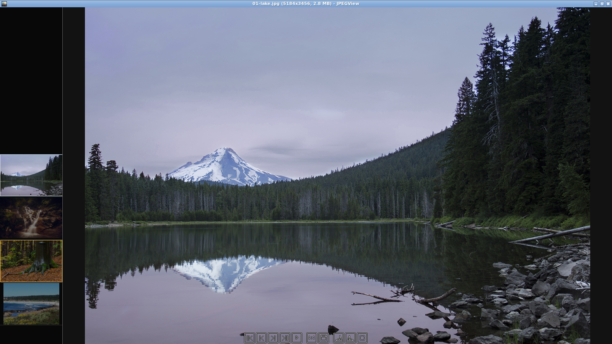
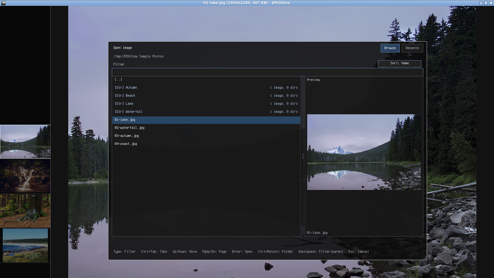
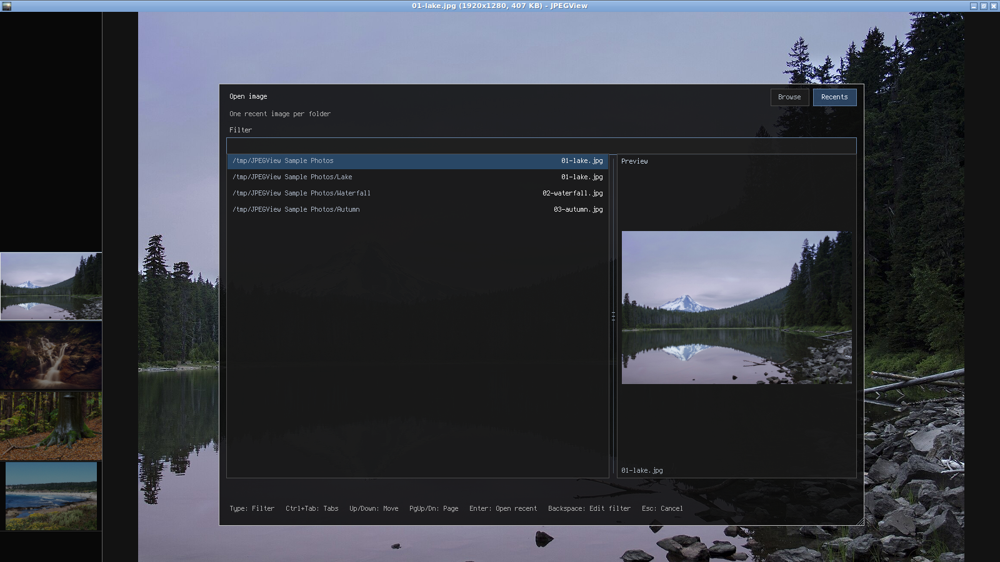
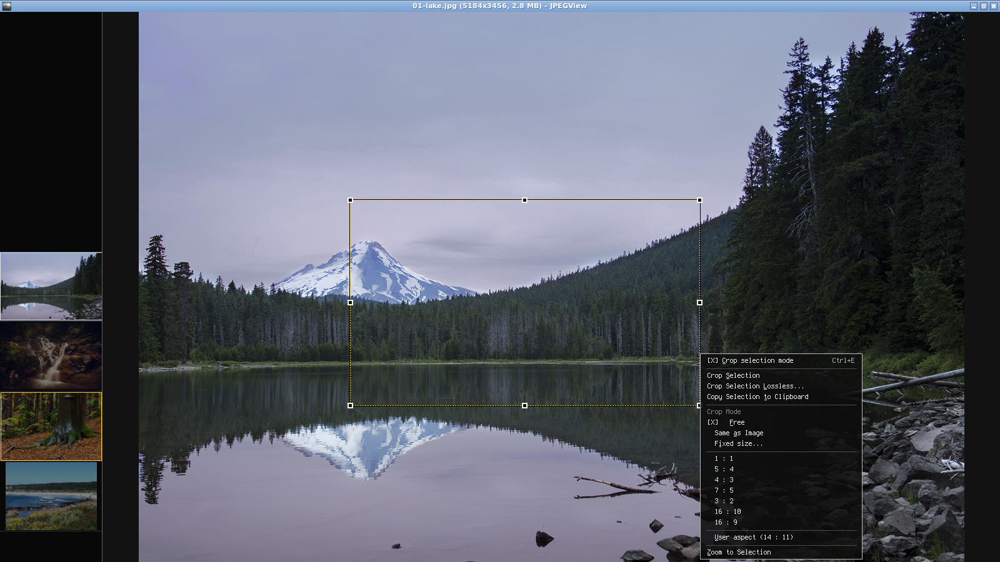
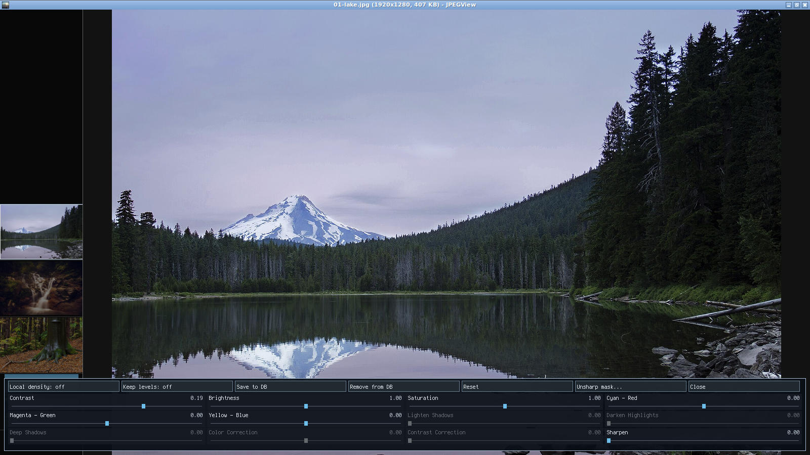
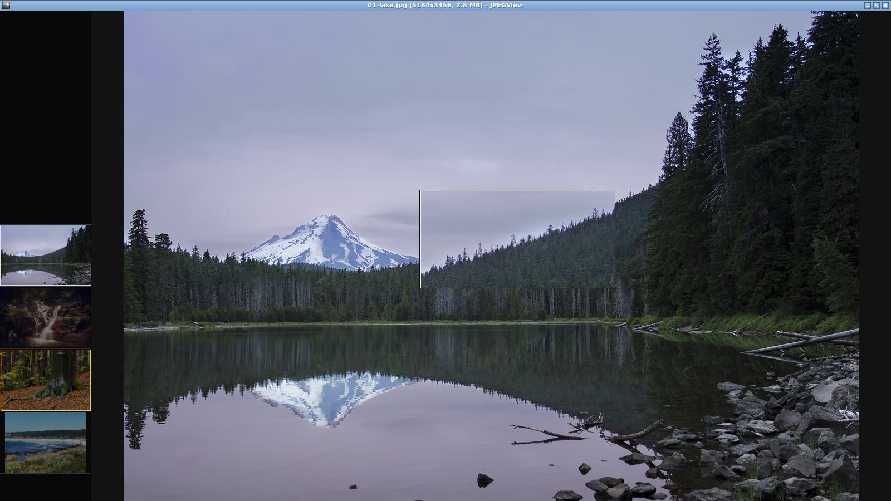
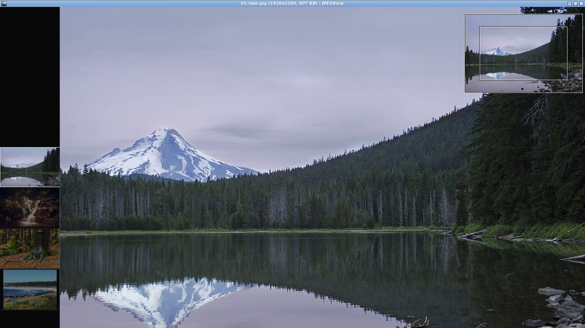
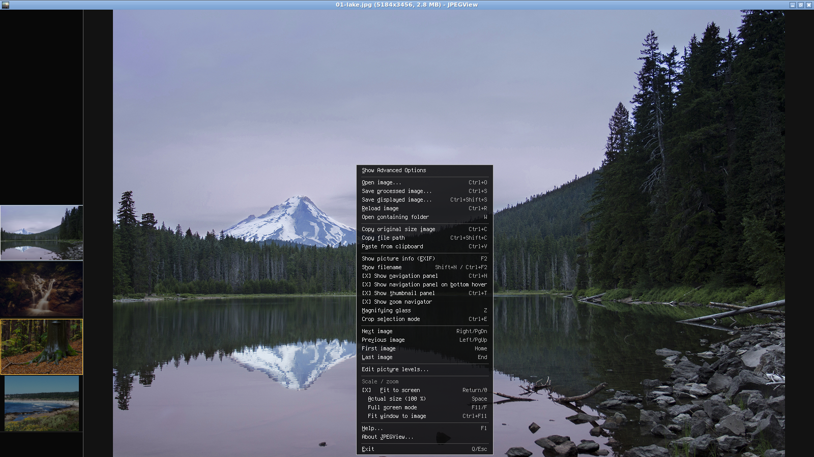
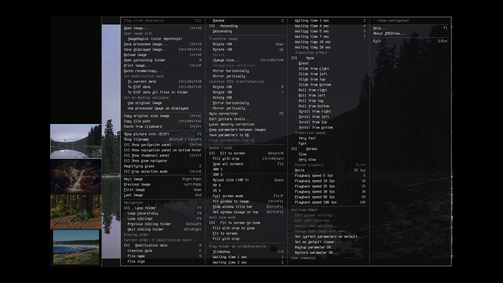

# JPEGView Linux frontend

This directory contains the first native Linux deliverable for upstream JPEGView v1.3.46.
The original Windows/ATL/WTL project remains unchanged under `src/`.

## Linux branch changes, in order of importance

This is the complete grouped summary of features and changes made since the native Linux branch
split from the Windows frontend. Later fixes, tests, and refactorings are grouped with the feature
they support.

1. **Native Linux viewer, AppImage, and Ubuntu 24/26 Debian packages.** A native SDL2 frontend now opens individual
   images, multiple command-line inputs, and directories without modifying the original Windows
   application. It includes a resizable/maximizable/fullscreen window, drag-and-drop, a desktop
   entry, the upstream JPEGView application icon, Ubuntu 20.04, 22.04, 24.04, and 26.04 build containers,
   AppImage packaging with bundled SDL and codec runtimes, and Ubuntu 24.04/26.04 `.deb` packages
   whose build and runtime dependencies come from the corresponding standard Ubuntu repositories.

2. **Broad native format and color support.** Linux decoding covers JPEG, PNG/APNG, GIF, BMP, TGA,
   PSD, PNM, QOI, WebP, TIFF, HEIF/HEIC, AVIF, JPEG XL, JPEG XR, and LibRaw camera formats. Embedded
   color profiles are transformed through LCMS2. Supported images inside ZIP, TAR, gzip-compressed
   TAR, and 7z containers can also be browsed and viewed. The save dialog writes JPEG, PNG, BMP, TGA,
   WebP, GIF, TIFF, PSD, PNM, QOI, HEIF/HEIC, AVIF, and JPEG XL still images. Codec detection and fixtures
   were made portable across Ubuntu 20.04 and newer distributions, including giflib installations
   without pkg-config metadata and HEIF encoders with different supported profiles. Transparent PNG
   and other alpha-bearing images display over a configurable black, white, or checkerboard
   background without flattening or changing their source pixels.

3. **High-quality viewing, fitting, zooming, and panning.** JPEGView's high-quality downsampling and
   sharpening path was ported, with bicubic enlargement and a shared 1 GiB image-cache budget.
   Fitted JPEGs use libjpeg-turbo's native reduced DCT decode, avoiding full 4000×6000 pixel buffers
   when the screen needs only a smaller image. Up to four hardware-aware, low-priority workers prepare
   the closest forward/backward pairs concurrently; the prefetch window is derived from the configured
   cache size and current viewport,
   so the default 1 GiB budget can cover roughly 128 full-HD neighbors. Large JPEG input is memory-mapped,
   letting native decoding and repeated neighboring access use the kernel page cache without an extra
   stdio copy layer. Prepared frames are then uploaded incrementally and retained as renderer-ready
   textures. The closest next and previous files take
   preparation and upload priority, and an already prepared static image is presented without first
   copying its full decoded pixels on the UI thread; navigation therefore avoids CPU resizing and
   normally avoids texture upload as well. Fit mode
   uses the full client area without artificial top/bottom gaps and does not enlarge small images.
   Fit, fill, actual-size, and manual modes survive navigation appropriately, while temporary zoom
   on one image is reset to the selected fit/actual mode for the next image. Ctrl+wheel zooms around
   the pointer, mouse dragging pans, and repeatable Shift+Arrow commands pan an actual-size image in
   the original 48-pixel steps. When magnified beyond the viewport, a transient upper-right zoom
   navigator shows the whole image and the visible area; click or drag it to pan. Its visibility
   can be toggled from the context menu and persists between runs. A transient
   pointer-following magnifying-glass lens is also available: press
   `Z` or choose **Magnifying glass** in the context menu, then move over the image. It starts at
   2× and hides the pointer beneath it. Wheel down/up grows/shrinks the lens; Ctrl+wheel changes
   its height, Alt+wheel its width, and Shift+wheel its magnification. Higher-resolution lens
   pixels are prepared asynchronously at low priority while the ordinary image remains responsive.
   Lens size and magnification persist between runs; the lens itself starts disabled each time. The
   Windows crop/selection workflow is also ported: source-pixel selections can be moved and resized
   independently of zoom, then cropped, copied, losslessly cropped from JPEG, or used to zoom the view.
   Crop selection mode is off by default and can be enabled from the new navigation-panel button,
   either context menu, or with Ctrl+E; the explicit mode choice is saved between runs.

4. **Folder navigation and ordering.** The Windows `CFileList` behavior was ported for first,
   previous, next, and last navigation; multiple inputs; folder looping; recursive subfolders;
   sibling folders; reload; and previous-folder history. Ctrl+M marks one image; after moving to a
   second image, Ctrl+Left/Right alternates between the marked image and the image that was current
   when toggling began. Marking another image replaces the mark. Alt+Left/Right jumps directly to
   the first image in the previous/next populated sibling folder, independent of the active mode.
   Ordering supports logical filename,
   filesystem modification date, creation date, file size, and random modes in either direction.
   The active filename/date ordering is visible and switchable from both the navigation panel and
   context menu, and the selected mode is preserved between runs.

5. **Responsive keyboard and mouse navigation.** Left/Right image navigation and menu/browser
   selection repeat while held. The open browser supports repeating Up/Down, PageUp/PageDown, and
   Home/End movement. Repeated image navigation presents progress immediately instead of freezing
   until key release. The plain mouse wheel selects the previous/next file, while holding Ctrl
   retains wheel zoom. The keyboard Context Menu key and the original Windows numeric command IDs
   and corresponding supported default bindings are retained.

6. **Neighboring-image thumbnail panel.** Ctrl+T or the context menu opens a vertical strip on the
   left in active file order. The current image stays centered and fully bright; neighboring images
   are darkened and clickable. A gold outline identifies the image marked with Ctrl+M, distinct from
   the current-image highlight. The panel reserves image space instead of covering the picture,
   preloads nearest files first, and retains every generated thumbnail for the active file list.
   Completed neighbor display frames feed a very-low-priority thumbnail worker, so nearby thumbnails
   appear during display prefetch without decoding the large source file again. Its divider is
   mouse-resizable,
   its width and visibility persist, and thumbnail row height follows panel width so a narrow panel
   fits more images without large fixed gaps. Thumbnails have no forced horizontal inset and only a
   one-pixel vertical margin plus separator; source-area antialiasing keeps reduced images smooth.

7. **Native navigation panel with automatic reveal.** The lower panel provides first/previous/next/
   last, ordering, fit/actual, rotate, and fullscreen controls with action tooltips. By default it
   appears when the pointer reaches the lower edge, with options to keep it shown or disable it.
   Its compact 32-pixel height, 26-pixel outlined buttons, off-white icons, and yellow hover feedback
   follow the original Windows panel style. Navigation, fit/actual-size, window, and rotation glyphs
   use the original Windows geometry and show the action that clicking will perform. Rendering is
   clipped to the panel bounds, and its visibility and hover preference persist.

8. **Complete adaptive context menu.** The Linux-rendered menu uses the Windows `PopupMenu` command
   vocabulary and shows shortcuts and checked states. Its compact view keeps common actions visible;
   one-off **Show Advanced Options** reveals navigation, ordering, transforms, correction, extended
   zoom/window/auto-zoom, slideshow, Open With, print, batch, date, wallpaper, settings, and disabled
   Windows-only administration entries without persisting the expanded state. Long menus split into
   columns, support Left/Right column movement and repeating Up/Down movement, remain inside the
   window when expanded, open at the current pointer, and can be opened from the keyboard menu key.
   Enabled command items with a Latin letter show an underlined mnemonic; pressing a unique letter
   activates it, while duplicate letters cycle matching entries for Enter. Printable-ASCII
   underlines follow visible bitmap-glyph bounds, avoiding stray pixels in the blank part of a
   character cell.

9. **Portable file and desktop operations.** The branch adds a native open/save browser, processed
   full-size and screen-size saving with overwrite confirmation, live case-insensitive filename
   filtering, name/newest-modification-date listing order, Ctrl+Return direct folder opening, and
   non-blocking direct image/directory counts for folder rows (supported archive containers count as
   directories), plus a focused-item preview that
   shows the selected image or the first image in a selected folder. The dialog can be resized from
   its lower-right corner, its preview width can be adjusted by dragging the list/preview divider,
   and the mouse wheel scrolls an overflowing file list. A visible proportional scrollbar supports
   thumb dragging and track clicks that page by one viewport, synchronized with wheel and keyboard
   scrolling.
   Dialog dimensions and the preview/list proportion are preserved between runs. The preview image
   is resampled to the pane's usable area
   after resizing, using the thumbnail panel's source-area antialiasing. Preview decoding runs in
   the background; its temporary pixels stay outside the viewer caches. Open dialogs also have a
   **Recents** tab with the same preview pane. It lists the most recently opened image from each
   parent folder, with the folder path on the left and filename on the right; its filter matches
   both path and filename. Browse and Recents keep their own selection and filter while switching.
   A bounded per-file history restores that image's last zoom and fit/fill/actual-size mode when it
   is opened again; files without a saved view inherit the shared navigation mode. ZIP, TAR,
   `.tar.gz`, `.tgz`, and `.7z` files appear as gold `[ZIP]`, `[TAR]`, `[TGZ]`, or `[.7Z]` directory
   rows in Browse. Entering one lists supported images and subfolders. Opening an archive directly
   starts at its root image list. Archive-member rows use the same gold cue in Browse, Recents, and the thumbnail
   strip, and Recents reuses the normal background preview path. ZIP browsing reads its central
   directory; TAR browsing indexes headers without extracting or retaining image payloads. 7z
   browsing uses libarchive's seekable reader and likewise retains only member metadata. Cold archive
   listings run in the background and obsolete scans are cancelled on navigation. Gzip TAR streams
   are sequential. 7z solid archives may require decoding earlier members to reach later ones, so
   indexing and navigation cost can vary with archive layout and compression settings. The selected
   image is streamed on demand through a short-lived anonymous memory file. Opening a cold TGZ or 7z
   directly as a command-line argument also needs an initial index; the Open dialog remains responsive
   while it builds that index. Password-protected ZIPs and encrypted 7z entries
   are not supported. Unsafe absolute or traversal paths, archive links, and devices are omitted;
   indexes are capped at 100,000 entries, and individual images are limited to 128 MiB uncompressed.
   That output-size cap does not limit a codec's own decompression workspace. The archive itself is
   never modified: image edits happen in
   memory and can be saved as ordinary files. Printing, Open With, date changes, trash, batch
   rename/copy, original-file wallpaper, and lossless JPEG transforms are unavailable for members.
   The recent-file
   list and view snapshots are stored separately from settings at
   `${XDG_STATE_HOME:-$HOME/.local/state}/jpegview-linux/recent-files.db` and are written on
   normal shutdown. The browser also provides move-to-trash
   confirmation, original-size image copy on Ctrl+C, path copy, PNG paste, printing through `lp`,
   modification-date updates from now or EXIF, wallpaper integration, folder exploration, and
   lossless JPEG rotation through `jpegtran`. The **Open image with** submenu discovers freedesktop
   `.desktop` applications
   and expands their file/URI placeholders. **Set as default viewer...** creates a user-local desktop
   entry and makes JPEGView the default for common image MIME types without root access; the desktop
   environment can change those defaults later. For an AppImage, repeat registration after moving the
   file so the saved launcher path stays current. F1 opens a concise Linux control-reference panel.

10. **Batch rename/copy and image resizing.** The batch dialog supports image selection, previews,
    saved Windows-compatible naming patterns, safe same-folder renames, and copying into newly
    created directories without overwrites. The resize dialog preserves aspect ratio across percent,
    width, and height fields and provides point, Lanczos/Bicubic, sharpen-low, and sharpen-medium
    filters. Both areas were separated into independently tested planning/model modules.

11. **Image processing and animation.** The Windows picture-level panel is ported: contrast,
    brightness/gamma, saturation, three color-balance axes, local shadow/highlight correction,
    correction strengths, and sharpening are editable with live preview. The separate unsharp-mask
    dialog previews radius, amount, and threshold before applying. Adjustments are non-destructive
    until save; per-image levels can be saved/removed in the parameter database, set as defaults for
    images without a saved entry, or kept between images. Automatic histogram correction remains
    available with F5. Animated GIF,
    APNG, WebP, AVIF, and JPEG XL honor frame delays and loop counts. Movie mode supports fixed frame
    rates and folder advancement, slideshow transitions are rendered natively, Alt+R resumes, and
    Escape stops active playback before quitting. Decoded pixels, prepared display frames, and
    retained renderer textures share one memory budget with per-layer LRU retention, while a
    low-contention background workers predecode nearby non-JPEG files in both directions. JPEG
    neighbors take the reduced-resolution display path directly, while full pixels remain lazy.
    Decode completions feed a
    separate display-preparation worker pool, and both decoded and display caches reject stale source
    identities. JPEG metadata parsing stops at the compressed scan instead of reading the full file
    on every navigation. Large evicted CPU buffers are retired on workers rather than destroyed on the event
    thread. Previously viewed and prefetched images
    therefore avoid repeated synchronous decoding, correction, high-quality scaling, and texture
    creation during navigation.

12. **Information overlays and window feedback.** F2 picture information and Shift+N/Ctrl+F2 filename
    overlays use compact translucent surfaces sized to their content with small comfortable margins.
    Filename, EXIF, and counter text remain responsive during navigation. The information popup uses
    a readable `W X H, Size` line and an unlabeled modification date. The EXIF popup includes a
    toggleable grayscale histogram, hidden by default. Overlay visibility persists
    immediately. The window title shows filename, dimensions, and size. Menus, dialogs, tooltips,
    and panels use the hinted 9-point Terminus bitmap when the complete string is printable ASCII,
    preserving lowercase letters as drawn and using crisp one-bit pixels without antialiased edges. Strings
    containing other characters use the desktop's configured UI font through Pango, retaining Unicode
    shaping and automatic installed-font fallback; translucent surfaces provide a consistent visual
    treatment. Bitmap-font text textures use nearest-neighbor sampling so the globally selected
    best-quality image filter cannot interpolate faint pixels into the blank edge of a glyph cell;
    image textures retain the best-quality filter.

13. **Reliable startup and saved session state.** Scale mode, default picture levels, ordering
    mode/direction, maximized or normal state, navigation-panel choices,
    filename/EXIF/histogram visibility, automatic correction,
    batch pattern, thumbnail visibility/width, open-dialog dimensions and preview proportion,
    magnifying-glass dimensions and magnification, and the
    image-cache budget are stored under XDG configuration paths. A previously
    maximized window is created maximized before it is shown, avoiding the visible delayed maximize.
    The real viewer window is painted and shown before the initial directory scan and image decode,
    so cold AppImage and large-folder startup provides immediate visual feedback without changing the
    image preparation or navigation path. Starting with a single directory argument that has no
    directly supported images now opens Browse at that directory instead of exiting. Compatibility
    handling keeps always-on-top optional on older SDL runtimes.

14. **Rendering and metadata correctness fixes.** Context-menu close no longer leaves a white pixel
    over the image or revealed navigation panel; borders avoid endpoint rasterization artifacts;
    overlays no longer retain unnecessary minimum widths; large images fit edge-to-edge; and signed
    EXIF rational values are parsed correctly. Context menus and modal panels trigger clean redraws
    and no longer damage underlying image pixels.

15. **Regression tests, modularization, and faster builds.** A dependency-light core suite and X11
    UI smoke suite now cover codecs, mutable image transforms/resampling, file ordering, browser
    state, settings, keyboard mappings, viewport geometry, overlays, context-menu columns and
    repainting, thumbnail layout/persistence, per-folder recent-file MRU and per-file viewport
    persistence, Recents-tab filtering/preview/open interaction, transparency-pattern settings,
    alpha metadata, resize and batch models, application discovery, startup maximization, and
    held-key behavior. Viewer logic was extracted into focused modules for image pixels, settings,
    sorting, input commands, viewport, recent-file history, open-dialog state, overlays, thumbnails,
    fonts, image information, context menus, resize, batch operations, archive sources, and desktop applications.
    Shell and sanitizer targets supplement the regular suites. Docker builds use distro codec
    packages where available and build only codecs missing from that Ubuntu release; independent
    codec stages and the viewer/tests compile in parallel.

## Build

The runtime framework dependencies are SDL2, Pango/FreeType, libzip for ZIP browsing, and libarchive
for TAR/TGZ/7z browsing. SDL2 development headers are not required because the frontend uses the small
ABI declared in `src/sdl_abi.h`; Pango development
headers and codec development packages are needed at compile time. The font stack is loaded only
when text outside the embedded printable-ASCII bitmap is used, so normal startup and ASCII UI do not
pay its initialization cost. The AppImage bundles these libraries while continuing to discover the
user's system fonts through Fontconfig.

On Ubuntu 20.04, install the compiler, make, and SDL2 runtime first:

```sh
sudo apt install g++ make libsdl2-2.0-0 libpango1.0-dev libfontconfig1-dev \
  libjpeg-dev libpng-dev libjpeg-turbo-progs libzip-dev libarchive-dev xclip wl-clipboard
```

```sh
make -C linux -j"$(nproc)"
linux/build/jpegview-linux image.jpg
linux/build/jpegview-linux /path/to/photos
```

The default link statically includes libstdc++ and libgcc. Set `STATIC_RUNTIME=` if a local
toolchain does not provide those static runtime archives.

## Isolated Docker build

The Ubuntu 20.04, 22.04, 24.04, and 26.04 Dockerfiles contain the compiler, SDL2, libzip, libarchive,
and optional codec development libraries for their respective releases. Ubuntu 20.04 builds JPEG XL and AVIF from
pinned sources; Ubuntu 22.04 uses its AVIF package and builds JPEG XL from source; Ubuntu 24.04 and
26.04 use distro codec packages and explicitly install libheif's HEVC decoder/encoder plugins because
their images omit recommended packages. The host only needs Docker; build outputs are written to a host
`out/` directory:

```sh
mkdir -p out
DOCKER_BUILDKIT=1 docker build -f linux/Dockerfile.ubuntu20 -t jpegview-linux-build:ubuntu20 .
DOCKER_BUILDKIT=1 docker build -f linux/Dockerfile.ubuntu22 -t jpegview-linux-build:ubuntu22 .
DOCKER_BUILDKIT=1 docker build -f linux/Dockerfile.ubuntu24 -t jpegview-linux-build:ubuntu24 .
DOCKER_BUILDKIT=1 docker build -f linux/Dockerfile.ubuntu26 -t jpegview-linux-build:ubuntu26 .
APP_VERSION=$(./linux/version.sh)
docker run --rm -v "$PWD/out:/out" jpegview-linux-build:ubuntu20 appimage "$APP_VERSION"
docker run --rm -v "$PWD/out:/out" jpegview-linux-build:ubuntu20 binary "$APP_VERSION"
```

The host-resolved version argument is preferred and is what CI and release builds use. For a
convenient local build, the wrapper can instead resolve the version inside the container if Git
metadata is mounted read-only:

```sh
docker run --rm -v "$PWD/.git:/src/.git:ro" -v "$PWD/out:/out" \
  jpegview-linux-build:ubuntu20 appimage
```

This requires a normal `.git` directory (rather than a worktree's `.git` pointer file) with the
relevant tags present. The wrapper adds `/src` to the container's Git safe-directory list for the
version lookup; with `--rm`, this does not change your host's Git configuration. If no usable Git
metadata is available and no version is passed, the build continues to use `0.0.0+unknown`.

The AppImage is named `out/JPEGView-Linux-${APP_VERSION}-x86_64.AppImage`; the native executable
is `out/jpegview-linux`. Substitute the Ubuntu 22.04, 24.04, or 26.04 image tag to use another build
environment. Passing the version resolved on the host is the simplest option; the read-only `.git`
mount above is an alternative. The Ubuntu 20.04 Dockerfile builds its Highway/JPEG XL and AOM/AVIF
dependency chains in parallel with BuildKit. Ubuntu 22.04 builds Highway/JPEG XL; Ubuntu 24.04 and
26.04 need no codec source builds. An optional `--build-arg APPIMAGETOOL_SHA256=...` pins the downloaded
AppImage tool. Build the release artifact with the oldest supported base (Ubuntu 20.04) when it
must also run on later Ubuntu releases; newer-base artifacts can require newer system glibc.

The Debian package Dockerfiles use only the standard Ubuntu 24.04 or 26.04 repositories for build
tools and runtime libraries. Ubuntu 20.04 and 22.04 do not produce a `.deb`.

```sh
DOCKER_BUILDKIT=1 docker build -f linux/Dockerfile.deb.ubuntu24 -t jpegview-linux-deb-build:ubuntu24 .
APP_VERSION=$(./linux/version.sh)
docker run --rm -v "$PWD/out:/out" jpegview-linux-deb-build:ubuntu24 deb "$APP_VERSION" 24
DOCKER_BUILDKIT=1 docker build -f linux/Dockerfile.deb.ubuntu26 -t jpegview-linux-deb-build:ubuntu26 .
docker run --rm -v "$PWD/out:/out" jpegview-linux-deb-build:ubuntu26 deb "$APP_VERSION" 26
```

These create `jpegview-linux_${APP_VERSION}_ubuntu24_amd64.deb` and
`jpegview-linux_${APP_VERSION}_ubuntu26_amd64.deb` in `out/`. Install the matching package with APT;
its shared-library dependencies are resolved from the corresponding Ubuntu repositories.

GitHub Actions builds and tests all four AppImage Dockerfiles on branch pushes and pull requests.
Each successful Ubuntu build job uploads its x86_64 AppImage, native executable, and a `SHA256SUMS`
file as a downloadable workflow artifact named `jpegview-linux-ubuntu20-x86_64`,
`jpegview-linux-ubuntu22-x86_64`, `jpegview-linux-ubuntu24-x86_64`, or
`jpegview-linux-ubuntu26-x86_64`. The Ubuntu 24 and 26 artifacts also include their matching `.deb`
packages; CI installs each package in its matching Ubuntu runtime container and checks `--help`.
These workflow artifacts are retained for 14 days and are
available from the workflow run's summary. When a GitHub Release is published, its workflow uploads
versioned AppImage and native executable assets for each Ubuntu base. The Ubuntu 24 release job also
builds and validates its `.deb` on Ubuntu 24, and the Ubuntu 26 job does the same on Ubuntu 26. Both
packages use only their release's standard repositories. Each release checksum file covers every
asset for its Ubuntu base. Asset names include the Ubuntu release because artifacts built on newer
bases may require newer system glibc.

If SDL2 is installed in a non-standard location, override the linker settings:

```sh
make -C linux SDL2_LIBS='-L/path/to/lib -lSDL2'
```

Supported input formats are JPEG, PNG/APNG (including animation), GIF (including animation), BMP, TGA, PSD, PNM-family files,
QOI, WebP (including animation), TIFF, HEIF/HEIC, AVIF, JPEG XL (including animation), JPEG XR/WDP/HDP, and LibRaw camera
formats such as CR3, CR2, NEF, DNG, ARW, RAF, and RW2. ZIP, TAR, `.tar.gz`, `.tgz`, and `.7z` archives
can contain any supported image format above; they are browsed read-only as virtual folders. The save
dialog can write JPEG, PNG, BMP, TGA, WebP, GIF, TIFF, PSD, PNM, QOI, HEIF/HEIC, AVIF, and JPEG XL
still images; RAW and JPEG XR are decode-only, and animated input is view-only.
JPEG uses the linked libjpeg implementation (libjpeg-turbo in the supported builds), common
single-frame formats use the vendored public-domain/MIT `stb_image` single-header library, and the
additional formats use their native codec libraries.

Display resizing follows JPEGView's high-quality path: downsampling uses its integrated
best-quality filter with the default sharpening value, and enlargement uses endpoint-preserving
Catmull-Rom bicubic interpolation. JPEG neighbors are first decoded at the smallest native DCT scale
(1/8, 1/4, 1/2, or full size) that still covers the target, then converted to exact display-size
bitmaps on low-priority background workers. This keeps fitted 4000×6000 files out of the
full-resolution path during ordinary navigation; requesting original pixels still performs and
caches a full decode. The SDL thread uploads completed frames incrementally—SDL renderer objects are
thread-confined—and retains the resulting textures under the shared configured LRU budget, keyed by
source identity, animation frame, correction mode, and target size. If preparation misses, SDL can
temporarily scale the source texture while the high-quality result is produced; the expensive CPU
resize never runs in the render loop.

Fit-to-screen mode does not enlarge images that are smaller than the available window; those images
remain at their native size and are centered. Larger images are reduced to fit as usual.

The native navigation panel, menus, tooltips, information overlays, and modal dialogs use
semi-transparent backgrounds so the image remains partially visible underneath them. Printable
ASCII text uses the crisp embedded 9-point Terminus bitmap. The atlas is generated from
`TerminusTTF-4.47.0.ttf` by extracting its embedded 12-pixel monochrome strike at 96 dpi; the
scalable outlines are deliberately not used. The TTF itself is not bundled. Text requiring Unicode
uses the desktop font discovered from XFCE, GTK, xsettingsd, or KDE configuration. Set
`JPEGVIEW_FONT` to a Pango font description such as `Sans 11` to override desktop discovery for that
Unicode fallback.

The default window title follows the Windows-style image title format:
`filename (widthxheight, file size) - JPEGView`.

## Application version

The build takes its version from the nearest reachable semantic-version Git tag. A clean build at
the tag uses that version (with an optional leading `v` removed); commits after it add `+devN`, where
`N` is the number of commits since the tag. Local changes add `.dirty` to the build metadata. For
example, five commits beyond `1.3.46-linux.3` produce `1.3.46-linux.3+dev5`. A Git checkout with no
reachable semantic-version tag uses `0.0.0+dev.g<commit>`, and a source snapshot without Git metadata
uses `0.0.0+unknown`.

The resolved version is embedded in the executable and shown by `jpegview-linux --version` and the
About panel. AppImage names and its `X-AppImage-Version` desktop metadata, plus Debian package
filenames/control metadata, use the same value. Direct Makefile or packaging-script builds resolve it
automatically; set `VERSION=...` for Make or pass a version argument to a packaging script to
override it. Docker builds do not include `.git`: pass the host-resolved version, or mount `.git`
read-only when running the container to let its wrapper resolve the version. The wrapper honors a
positional version first, then `JPEGVIEW_VERSION`, before attempting Git discovery. The `+devN`
suffix is SemVer build metadata and identifies the build without changing semantic-version
precedence; release tags remain the release-version authority.

## AppImage

The packaging script creates an AppDir, bundles the SDL2 shared library, and invokes
`appimagetool` when it is available:

```sh
mkdir -p out
VERSION=$(./linux/version.sh)
APPIMAGETOOL=/path/to/appimagetool \
APPIMAGETOOL_ARGS=--appimage-extract-and-run \
BUILD_DIR="$PWD/out/build" \
APPDIR="$PWD/out/JPEGView-Linux.AppDir" \
OUTPUT="$PWD/out/JPEGView-Linux-${VERSION}-x86_64.AppImage" \
make -C linux appimage VERSION="$VERSION"
```

The resulting AppImage still relies on the host kernel, glibc-compatible userspace, and a
working X11 or Wayland display server. Codec and SDL dependencies are carried with the artifact;
Ubuntu 20.04 runtime compatibility still needs to be verified by running this image in the
intended Docker environment.

The native window and AppImage desktop entry both use the largest frame embedded from the upstream
`src/JPEGView/res/JPEGView.ico`. Packaging exports that same frame as a Linux icon-theme PNG without
requiring an external image-conversion tool.

## Tests

The dependency-light core suite builds and runs with:

```sh
make -C linux test
```

The Unicode font-rendering test requires at least one installed system font. The Ubuntu Docker
build installs `fonts-dejavu-core` for this purpose; this font is not bundled into the AppImage,
which continues to use fonts installed on the user's system.

It covers file-list ordering/navigation, mutable image transforms, source-coordinate crop selection,
aspect/fixed-size geometry, manipulation/hit-testing, MCU alignment and image cropping, all resize
filters and automatic correction invariants, sort and settings persistence mappings, the complete supported
keyboard-command mapping, viewport fit/fill/zoom/pan and zoom-navigator geometry, bounded navigator
panning, open/save browser state, preview
downsampling, resize- and crop-size-dialog editing/validation, scrollbar geometry and row-offset
mapping, content-sized overlay layout, compact/advanced menu filtering and
keyboard selection, thumbnail layout/resampling, shared cache accounting, reduced JPEG display
decoding, and nearest-display upload priority, desktop-font resolution, decoder and writer round
trips across static and animated formats, ZIP/TAR/TGZ/7z listing and member decoding, path-traversal
rejection, nested archive navigation and archive-backed recent previews, cancellable archive indexing,
all PNM variants, malformed input, batch-copy planning,
desktop-application command expansion, and JPEG metadata. The optional X11 smoke suite covers the
open browser's filtering, folder counts, sorting, direct-folder opening, ZIP/TGZ/7z browsing and recent
reopening, focus restoration, paging, Home/End, held-key movement, wheel and scrollbar scrolling/dragging, and
dialog/preview resizing; thumbnail
display/resizing/clicking/persistence; sibling-folder hotkeys; context-menu mnemonics, expansion,
and repainting; startup controls;
mouse-wheel navigation versus Ctrl+wheel zoom; held image navigation; crop-mode dialog, selection
overlay, crop, and lossless JPEG output; zoom-navigator visibility, click-to-pan, and drag-to-pan;
maximize restoration; and persisted settings:

```sh
make -C linux test-ui
```

The UI suite uses `Xvfb`, `openbox`, `wmctrl`, and `xdotool`; it reports `SKIP` when those tools are
not installed. When ImageMagick's `import` and `compare` are available it also checks the context
menu repaint pixel-for-pixel. `make -C linux check` runs both suites plus shell syntax checks and
ShellCheck when installed. `make -C linux test-sanitize` rebuilds the core suite with AddressSanitizer
and UndefinedBehaviorSanitizer. Leak detection is disabled for that target because linked desktop
font and optional codec libraries retain process-global caches. The Ubuntu Docker build runs the
core suite.

## Controls

Right/Left or PageUp/PageDown navigate; Home/End select the first/last image; mouse wheel up/down
navigates previous/next, while Ctrl+mouse wheel and Ctrl+Up/Down zoom around the pointer or center.
When the image extends beyond the viewport, hover the upper-right corner to show the zoom navigator;
click or drag the miniature image to reposition the view. **Show zoom navigator** in the context menu
toggles it, and that preference is saved between runs.
Up/Down rotate 90 degrees. Space toggles fit/actual, Return/0 fits, Ctrl+Return fills with crop,
`+`/`-` zoom, and F11/F toggles fullscreen; F12 spans screens, Ctrl+F11 fits the window to the
image, Shift+F11 hides the title bar, and Shift+F12 toggles always-on-top. `1`–`9` start a
slideshow at that interval. At actual size, Shift+Arrow pans the image in 48-pixel steps. F2
toggles the top-left picture information panel; Shift+N or Ctrl+F2
toggles the filename overlay, while N/M/C select filename, modification-date, or creation-date
sorting; random sorting remains available from the context menu. `Z` toggles the magnifying-glass
lens when an image is open. It follows the pointer and hides it while over the image to keep the
center of the lens unobstructed. Use wheel down/up to enlarge/shrink the lens;
Ctrl+wheel changes lens height, Alt+wheel width, and Shift+wheel magnification. The lens is
disabled when the app starts, but its size and magnification persist between runs. Ctrl+O opens the
native in-app file browser with **Browse** and **Recents** tabs.
Clicking blank space inside the dialog leaves it open; press Escape to cancel.
Browse filters filenames while Recents filters full file paths; both searches are case-insensitive.
The Recents tab contains one MRU image per parent folder, keeps its own selection and filter while
switching tabs; Ctrl+Tab switches between Browse and Recents. It previews and opens the focused
image with Enter or a double-click. The history also remembers each file's last zoom and
fit/fill/actual-size mode for later opens. Type any part of a filename to filter the Browse listing,
then press Enter to open the selected match. Ctrl+Return
opens a selected folder immediately at its first compatible image without entering the folder in
the dialog. The sorting control switches the listing between case-insensitive filename order and
newest-first modification-date order. Backspace removes one complete UTF-8 character from the
filter and navigates to the parent folder once the filter is empty. Up/Down move one row,
PageUp/PageDown move one visible page, and Home/End select the first/last row; all six keys repeat
while held. Entering a folder selects its first child rather than the `[..]` parent row; returning
to the parent selects the folder that was just exited. Folder rows show
right-aligned counts of compatible images and directories at their immediate level; supported
archive containers count as directories, and the counts are calculated in the background. The mouse
wheel scrolls the visible file list; its vertical scrollbar
can be dragged or paged by clicking the track. Drag the dialog's lower-right corner to resize it, or
drag the vertical separator to adjust the preview width. A
preview alongside the list follows the focused file, or the first image in a focused folder using
the current listing order. Ctrl+R reloads, and
Ctrl+N toggles the navigation panel. Ctrl+T toggles a thumbnail strip on the left. Ctrl+C copies the
image at original size, Ctrl+Shift+C copies its path, Ctrl+V pastes a
PNG image, Ctrl+P sends the processed image to `lp`, and Delete opens the move-to-trash confirmation.
Ctrl+M marks the current image; after navigating to another image, Ctrl+Left/Right alternates between
the marked image and the image current when toggling began. The mark stays in memory only, is not
saved between runs, and is replaced by the next Ctrl+M.
Ctrl+Shift+M/E set the modification date to now/EXIF date; R/T perform lossless JPEG rotations when
bundled `jpegtran` is available; F5 toggles the ported automatic histogram contrast correction, and
Ctrl+Shift+R opens the image resize dialog. Ctrl+E toggles crop selection mode; the new last button
on the bottom navigation panel and the context-menu item toggle the same mode. On the image, drag
pans when the image extends past the window. When the image fits, an ordinary drag creates a
selection only while crop selection mode is enabled; Ctrl-drag remains a one-off selection override
at any zoom. Shift-drag zooms to the selected region. Drag the selection body to move it or its
handles to resize it; release opens the crop menu, right-click reopens it, and Escape clears the
selection. Choosing Free, an aspect ratio, or applying a fixed-size crop also enables crop selection
mode. Crop Selection crops the processed image in memory; Lossless Crop saves an MCU-aligned JPEG
to a chosen path; Copy Selection places source-resolution pixels on the clipboard; and Zoom to
Selection fits the selected rectangle into the view. Move the pointer to the lower edge of the window to
show the navigation panel, whose buttons mirror the core controls from JPEGView's Windows
navigation panel (first/previous/next/last, ordering mode, fit/actual, and fullscreen). The
ordering button shows `N` for file-name order and `D` for modification-date order; clicking it
switches between those two modes. By default the panel is hidden until the pointer enters the
lower edge of the window; the context menu can disable this automatic reveal mode. Ctrl+N
disables the panel entirely, and the panel is temporarily suppressed while a modal menu or file
browser is open. F1 opens the Linux quick-help panel. Right-click or the keyboard Context Menu key
opens the compact core JPEGView context menu; Show Advanced Options temporarily restores Open image
with, Print, batch rename/copy, date and wallpaper commands, extended navigation and sorting, image
transforms and correction, extra zoom and window controls, slideshow controls, and settings
administration, including the user-local default-viewer registration and disabled Windows-only
commands, without saving that choice. The compact menu keeps common navigation, fit/actual-size,
fullscreen, and fit-window-to-image commands available. The menu also supports keyboard selection
with Up/Down and Return. Underlined letters activate uniquely matching enabled commands; if a letter
is shared, press it repeatedly to cycle the matching rows and press Enter to activate the selection.
If the menu spans multiple
columns to fit the window height, Left/Right moves between columns. Hovering over a lower
navigation-panel button displays its Windows-style action hint. Unseen files inherit the shared
fit/fill/actual-size or manual mode as navigation proceeds; a previously visited file restores its
own last view when opened again. Magnifier size and zoom use `magnifying_glass_width` (default 350),
`magnifying_glass_height` (default 175), and `magnifying_glass_zoom_level` (default 0.5); the lens
itself remains disabled at startup. The shared scale mode remains saved between application runs, as
does the last maximized or
normal window mode, the lower navigation panel's show/hide selection, and the F2/Ctrl+F2 overlay
visibility choices. The navigation panel hover preference and current file-order mode/direction are
also saved, together with the thumbnail-panel visibility and zoom-navigator preference. These
settings are stored in
`${XDG_CONFIG_HOME:-$HOME/.config}/jpegview-linux/settings.conf`. Esc stops an active slideshow first,
matching the Windows default escape command, and otherwise quits.

Recent paths and per-file view snapshots are kept in
`${XDG_STATE_HOME:-$HOME/.local/state}/jpegview-linux/recent-files.db`, separately from settings.
The recent-folder list is capped at 100 entries and the independent viewport history at 256 files.
Only successfully loaded image paths enter history; clipboard-pasted temporary images are excluded.

The zoom navigator is enabled by default. Set `show_zoom_navigator=0` in the settings file to hide
it; the context-menu toggle updates this preference immediately.

Transparent image pixels use a black background by default, matching the Windows configuration.
Set `transparency_pattern=white` or `transparency_pattern=checkerboard` in
`${XDG_CONFIG_HOME:-$HOME/.config}/jpegview-linux/settings.conf` to choose another display
background; `black`, `white`, and `checkerboard` are the accepted values. This setting has no GUI
control yet. It applies to the main viewer, thumbnail panel, and open-dialog preview; it only changes
how alpha is composited on screen and does not flatten or alter saved image pixels.

The same settings file accepts `cache_size_mb=1024` to control the aggregate memory retained for
decoded images, worker-prepared display frames, and renderer-ready textures. The value is in MiB,
takes effect at the next launch, and defaults to 1024. Set it to `0` to disable retained image/display
caching; this does not disable the separate thumbnail cache, whose generated entries are retained for
the active file list regardless of the large-image budget.

The thumbnail panel is hidden by default and can be enabled from the context menu or with Ctrl+T.
It follows the active file ordering in a vertical strip: the current image remains centered and at
normal brightness, while surrounding images are darkened. The image marked with Ctrl+M has a gold
outline when it is in the displayed list, even when it is not the current image. Clicking a thumbnail
opens that file.
Thumbnails are loaded incrementally in nearest-to-current order and kept for the active file list.
Display-ready neighbor pixels are reused for thumbnail preparation when available; remaining
entries are decoded during idle time. The panel reserves its own space on the left instead of
covering the image. Drag its right
separator to adjust its width; row height follows the width, so narrower panels display more
thumbnails without large fixed vertical gaps. The width and visibility are preserved between runs.

The port follows the Windows `CFileList` navigation model: the default display order is ascending
file modification time from the filesystem; `N`, `M`, `C`, and `Z` select filename, modification
date, creation date, and random order. `F7` loops the current folder, `F8` traverses non-empty
subfolders, and `F9` traverses sibling folders. Alt+Left/Right opens the first image in the previous
or next populated sibling folder without changing the active navigation mode. The navigation panel
and context menu show the current display-order mode, and the context menu exposes the same
navigation and sorting commands, including these sibling-folder jumps.
Previous-folder history is retained when F8/F9 traversal enters another directory. Explicit Alt+Left/Right
jumps discard that history so subsequent Left/Right navigation follows the active mode within the
destination folder.

The context menu is a native rendering of the Windows `PopupMenu` resource, including its navigation,
sorting, slideshow/movie, transform, zoom, auto-zoom, settings, and administration sections. The
portable commands include folder opening, printing through `lp`, modification-date updates, GNOME/
`feh`/`nitrogen` wallpaper integration, text/image clipboard copy and paste, filename and EXIF
overlays, slideshow transitions, window mode toggles, and `jpegtran`-backed lossless JPEG transforms.
The `Auto correction` command uses the Windows histogram-derived RGB correction LUT and can be toggled
with `F5`. `Edit picture levels...` opens the bottom adjustment panel; drag its sliders for live
preview, turn on `Local density` to enable the shadow/highlight controls, and use `Reset` to restore
the neutral slider values. Color/contrast correction strength controls refine automatic correction
and are available while automatic correction is enabled.
The separate `Unsharp mask...` dialog previews radius, amount, and threshold and has Apply/Cancel
actions. `Keep levels` carries current adjustments to the next image and temporarily takes precedence
over saved per-image values. With keep disabled, each saved entry (including its auto-correction and
local-density state) is restored for that image. Save/remove actions are disabled while Keep levels is
on; `Set current parameters as default...` stores slider values and automatic-correction state for
images without a saved entry. Removing an entry restores those defaults. The Linux-native
`picture-levels.db` is stored in the JPEGView Linux configuration directory
(`$XDG_CONFIG_HOME/jpegview-linux`, or
`~/.config/jpegview-linux` when XDG_CONFIG_HOME is unset). All levels remain non-destructive until
the processed image is saved.
`Backup parameter DB...` opens the save browser, defaults to `picture-levels-backup.db` beside the live
database, and writes an atomic Linux-native copy that can be moved to another installation.
`Restore parameter DB...` lists backup files in that directory (or a browsed subdirectory), validates
the selected database before asking for confirmation, then atomically replaces the live database.
Invalid files leave the active database untouched. Windows binary parameter databases are not
compatible with this Linux text format.
The `Open image with` submenu is populated from matching freedesktop `.desktop` applications and
launches them with the current image, including standard `%f`/`%F` and URI placeholders. Applications
are discovered from the user and system application directories at menu-open time.
`Batch rename/copy...` is also available: select images, preview a Windows-compatible target pattern,
save it as a template, and rename within the folder or copy into newly-created subdirectories without
overwriting existing files. Its `%pictures%` placeholder maps to `$XDG_PICTURES_DIR` or `$HOME/Pictures`.
`Change size...` is ported from the Windows Resize dialog: percentage, width, and height edits retain
the aspect ratio, and the point, Lanczos/Bicubic, sharpen-low, and sharpen-medium filters are available.
The resize is applied to the processed image in memory and can then be saved with `Ctrl+S`; `Ctrl+Shift+R`
opens the same dialog directly.

Crop selection mode is off by default. Enable or disable it with Ctrl+E, the last button on the bottom
navigation panel, or **Crop selection mode** in the regular or selection context menu; its state is
saved between runs. When enabled, an ordinary drag on an image that fits the view creates a
selection. Ctrl-drag remains a one-off way to create a selection at any zoom, even while the mode is
off; dragging an image larger than the viewport pans unless Ctrl is held. Shift-drag zooms into the
selected region; otherwise releasing a new selection opens its crop menu. Choosing Free, an aspect
ratio, or applying a fixed-size crop also enables crop selection mode. Drag the selection interior
to move it and its border handles to resize it; right-click reopens the menu and Escape clears the
selection. The menu can crop the processed image in memory, copy the selection at source resolution,
or zoom to it. A lossless JPEG crop opens the save
browser and aligns the requested rectangle to the JPEG's actual MCU grid; the displayed dimensions are
the aligned dimensions and the source is not replaced unless explicitly chosen. Crop recalculates
active picture-level/automatic corrections on the cropped source pixels. Cropping an animated image
flattens the currently displayed frame.

`Fixed size...` opens a dialog for width, height, and screen-pixel versus image-pixel units. Screen-pixel
sizes track the current zoom, while image-pixel sizes remain in source pixels; while drawing, the
pointer positions the fixed rectangle's top-left corner. The fixed size and unit choice are persisted
when applied. To customize the final crop-menu ratio, set
`user_crop_aspect_width=14` and `user_crop_aspect_height=11` (or another positive pair) in
`${XDG_CONFIG_HOME:-$HOME/.config}/jpegview-linux/settings.conf`. The explicit crop-selection mode
is persisted as `selection_mode_enabled=0` or `selection_mode_enabled=1` and defaults to `0`. The
older `default_selection_mode` setting is ignored so an existing Windows-parity default cannot
silently reactivate crop mode.
The AppImage bundles `xclip`, `wl-copy`/`wl-paste`, and `jpegtran` when the build environment provides
them. `lp`, `gsettings`, `feh`, and `nitrogen` remain host desktop integrations. The clipboard tools
are also needed for image copy/paste in a local non-AppImage build.

Animated GIF, APNG, WebP, AVIF, and JPEG XL images start playing automatically at their embedded frame
delays. The `Movie` menu plays animated or multi-page images at a selected fixed rate (5, 10, 25,
30, 50, or 100 fps), and advances a folder of still images when the current image has no frames.
The original frame loop count is honored when a format provides one. `Alt+R` resumes stopped playback.
`Esc` stops animation, movie, or slideshow playback before it closes the viewer.

### Known Windows-parity gaps

The Linux port does not yet match every user-facing Windows feature. The outstanding items identified
by comparing the Linux frontend with the Windows menus and feature panels are:

The intentionally disabled context-menu commands are **Rotate...**, **Perspective correction...**,
**Edit global settings...**, **Edit user settings...**, **Update user settings...**, and **Manage Open
image with menu...**. These map to the gaps below; commands disabled only because their current
preconditions are unmet (for example, an image-only action when no image is loaded) are not missing
features.

- **Free rotation and perspective correction.** The quarter-turn/mirror operations are available,
  but the interactive free-rotation and perspective/tilt-correction panels are not implemented.
- **Image comparison.** Mark-image/toggle-back is available with Ctrl+M and Ctrl+Left/Right. The
  second processing-parameter set exchange workflow is not implemented.
- **Settings administration.** Editing global/user Windows configuration files and updating a user
  configuration from the global template are not available. The Linux frontend uses its own XDG
  settings file and does not translate every Windows setting.
- **Open-With management and user commands.** Open-With applications are discovered automatically
  from freedesktop `.desktop` files, but there is no manual menu editor. Windows-style custom user
  command definitions and their invocation menu are also absent.
- **Desktop association management.** `Set as default viewer...` registers common image MIME types
  for the current executable. A Windows-style per-extension selection dialog is not implemented,
  and specialized camera-RAW MIME aliases vary between Linux desktops; the desktop environment can
  refine the resulting defaults.
- **Parameter database administration.** Per-image parameters work in the Linux-native text database,
  and `Backup parameter DB...` / `Restore parameter DB...` export and restore Linux-native copies.
  Neither the live file nor its backups are compatible with the Windows binary DB.
- **Print setup and full Windows help content.** Printing currently delegates to `lp` with desktop
  defaults rather than offering the Windows print-layout/options dialog. F1 opens a concise Linux
  quick-help panel, but the full Windows help content and localization are not ported; `--help` also
  lists the available controls.

The context menu keeps the applicable unsupported Windows commands visible but disabled. This list
tracks user-facing parity gaps; it does not include Windows-only implementation details that have no
Linux equivalent.

`Ctrl+S` opens the native save dialog for a full-size processed image; `Ctrl+Shift+S` saves the
displayed screen-size result. The additional output formats listed above are selected by their
filename extension, with the default filename following Windows JPEGView's `<name>_proc.jpg`
convention. Existing files require a second Enter to confirm replacement. The source file itself
remains unchanged unless a lossless JPEG transform or confirmed delete is explicitly selected.

The Linux command dispatcher uses the original numeric `IDM_*` values from
`src/JPEGView/resource.h`, and the supported keyboard bindings follow the corresponding entries
in `src/JPEGView/Config/KeyMap.txt.default`. This keeps the portable SDL input layer translating
into the same command vocabulary as the Windows `CMainDlg::ExecuteCommand` path. The context menu
is currently a native Linux rendering of the complete Windows `PopupMenu` resource; unsupported
Windows-only commands are shown disabled rather than being silently ignored.

## Architecture and future refactoring

Platform-independent behavior is split into small modules under `src/` and exercised by the core
suite; `main.cpp` is the SDL window, rendering, and event-dispatch composition layer. See
[`ARCHITECTURE.md`](ARCHITECTURE.md) for module ownership, the completed Viewer extractions, and the
ordered refactoring backlog. Possible future user-facing work is tracked separately in
[`FEATURE_CANDIDATES.md`](FEATURE_CANDIDATES.md); those ideas are not commitments or a release plan.

## Screenshots

The main viewer with the neighboring-image strip, lower navigation controls, and the gold outline
on a marked image:

<p></p>

The resizable Browse dialog with folder counts, a selected image, and its live preview:

<p></p>

The Recents tab keeps one image per folder and shows the focused image in the same preview pane:

<p></p>

Crop selection mode provides a movable, resizable source-area selection and a crop-action menu:

<p></p>

Picture levels are adjusted live in the bottom panel:

<p></p>

The magnifying glass follows the pointer and shows a magnified area of the image:

<p></p>

When zoomed beyond the viewport, the upper-right navigator shows the whole image and the current
view area:

<p></p>

The compact context menu exposes the newer viewing controls and underlined keyboard mnemonics:

<p></p>

Choosing **Show Advanced Options** expands the full context menu into columns. It includes sibling-
folder navigation with Alt+Left/Right; click the image to view the full-resolution capture:

<p><a href="screenshots/context-menu-advanced.png"></a></p>

The sample photos shown are CC0 images from Wikimedia Commons: [Lake Mountain Landscape](https://commons.wikimedia.org/wiki/File:Lake_Mountain_Landscape.jpg),
[Waterfall in forest](https://commons.wikimedia.org/wiki/File:Waterfall_in_forest.jpg),
[Autumn Forest Wet Bark](https://commons.wikimedia.org/wiki/File:Autumn_Forest_Wet_Bark.jpg), and
[Beach Scene](https://commons.wikimedia.org/wiki/File:Beach_Scene.jpg).
